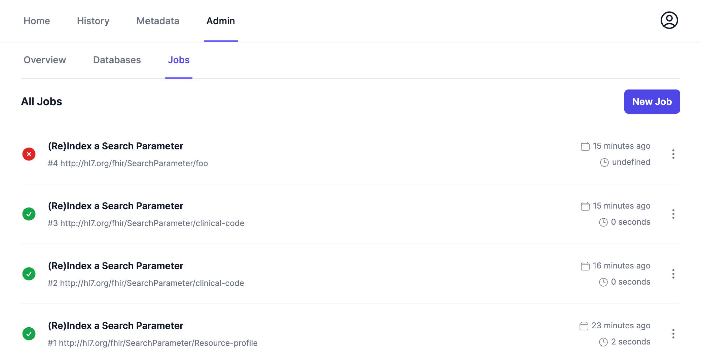
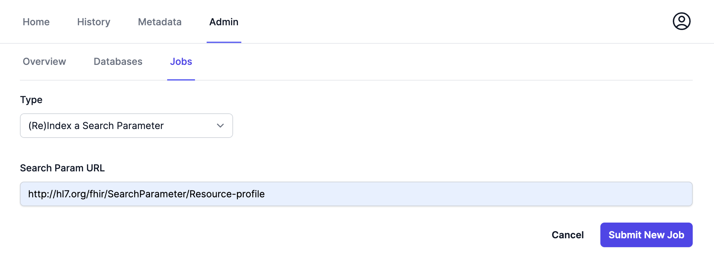
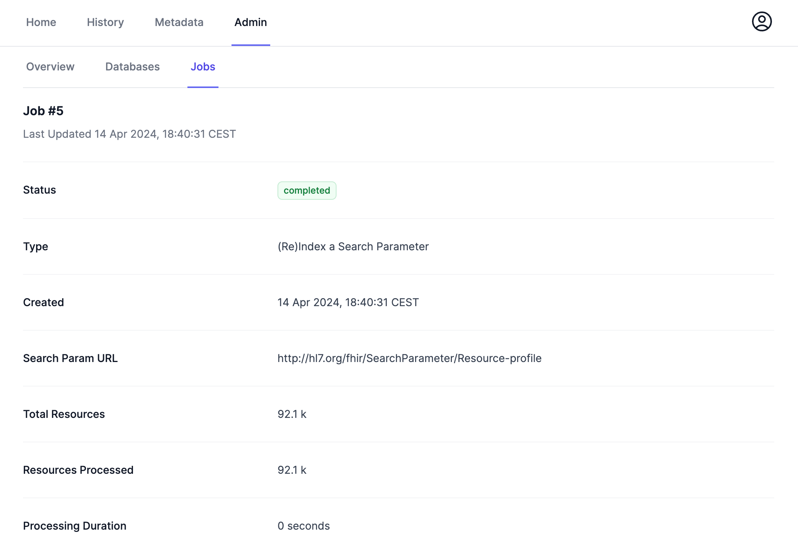

# Frontend (Web UI)

Blaze comes with a Web UI that provides a user friendly view on the FHIR data and and administrative UI.

## FHIR View

**TODO**

## Admin UI

**TODO**

### Job System

The next part of the Admin UI is a job system were background jobs of Blaze can be managed. Currently the only available job type is **(Re)Index a Search Parameter**.  

A new job can be created by clicking on the **New Job** button on the Jobs page in the Admin UI.

After that a page with a job form opens. For the **(Re)Index a Search Parameter** job, the URL of the search parameter has to be specified.

After submitting the job, the job detail page will open.

