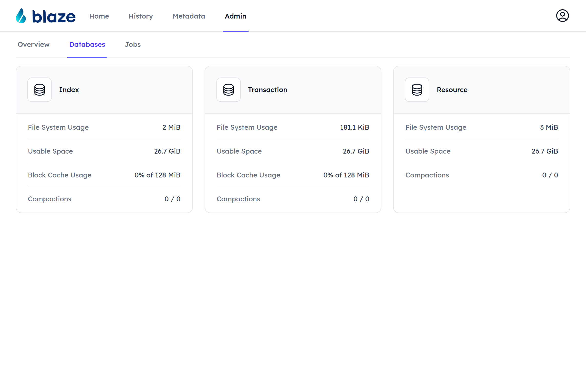
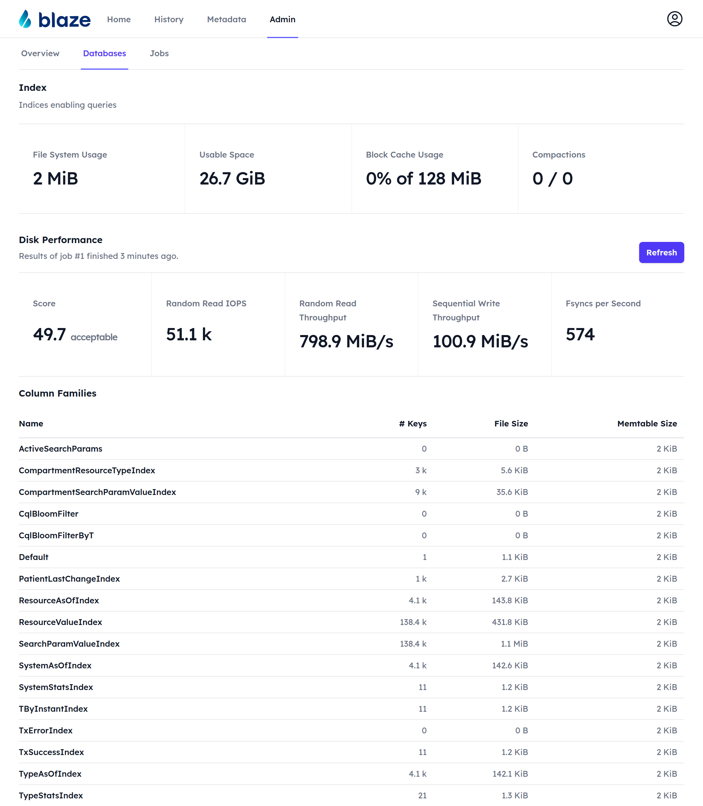
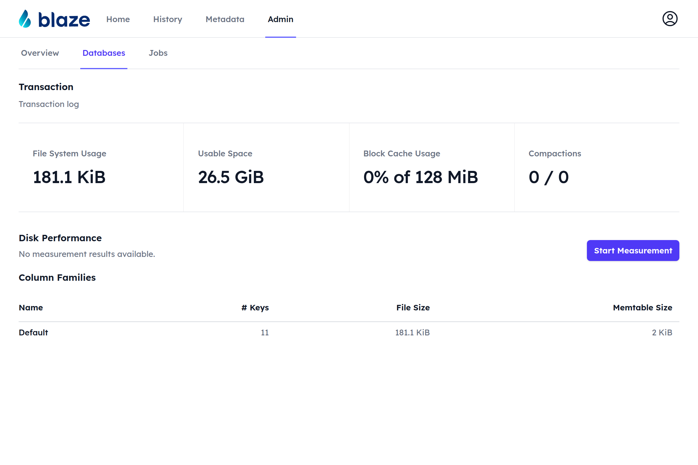
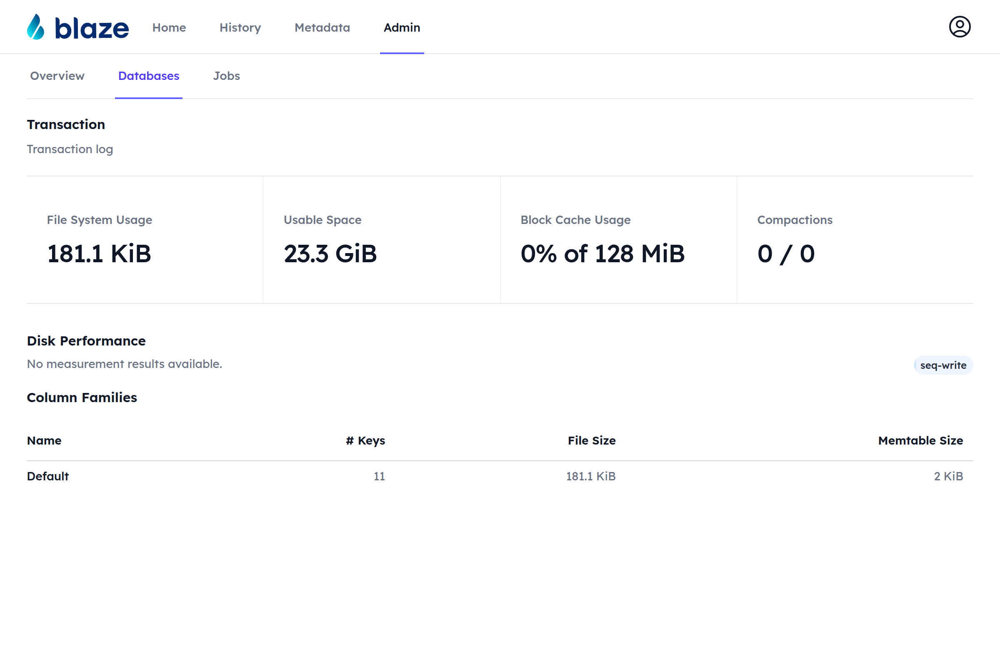
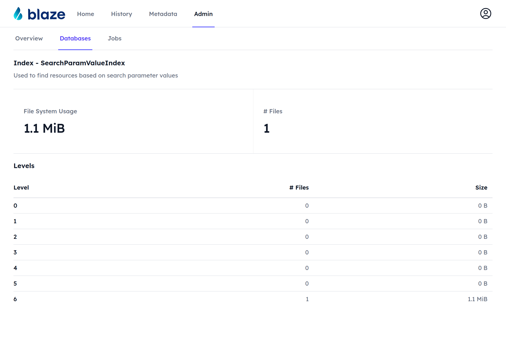

# Databases

The **Databases** section of the Admin UI gives insight into the RocksDB databases Blaze uses. In the standalone storage variant, there are three databases:

* **Index** — indices enabling queries,
* **Transaction** — the transaction log,
* **Resource** — the store holding the resource contents.

## Database Page

Clicking on a database card opens the page of that database. At the top, it shows the following statistics:

* **File System Usage** — the estimated size of the live data of the database,
* **Usable Space** — the free space on the volume the database directory resides on,
* **Block Cache Usage** — the memory used by the block cache, if the database uses one,
* **Compactions** — the number of pending / running compactions.

### Disk Performance <Badge type="info" text="Feature: ADMIN_API"/> <Badge type="warning" text="Since 1.11"/>

Right above the column families, the database page shows the results of the most recent [disk performance measurement](../performance/disk-perf.md#built-in-measurement) of the volume the database directory resides on: the overall score with its rating, the best random read IOPS, sequential write throughput and fsyncs per second, followed by a plot and a table of the random read IOPS per concurrency. The line below the heading links to the job that produced the results.

The **Refresh** button starts a new measurement job with default parameters. In case no measurement was run so far, no results are available and a **Start Measurement** button is shown instead:

While a measurement job runs, the buttons are replaced by the current phase and its progress. The page updates automatically and shows the results as soon as the job finishes.

A measurement with custom parameters (database, file size, phase duration, max concurrency) can be started on the Jobs page by creating a new **Measure Disk Performance** job.

### Column Families

The bottom of the database page lists all column families of the database with their estimated number of keys, the total size of their SST files and the size of their memtables.

## Column Family Page

Clicking on a column family opens the page of that column family. It shows the file system usage and the number of SST files, as well as the number of files and total size of each level of the LSM tree.

