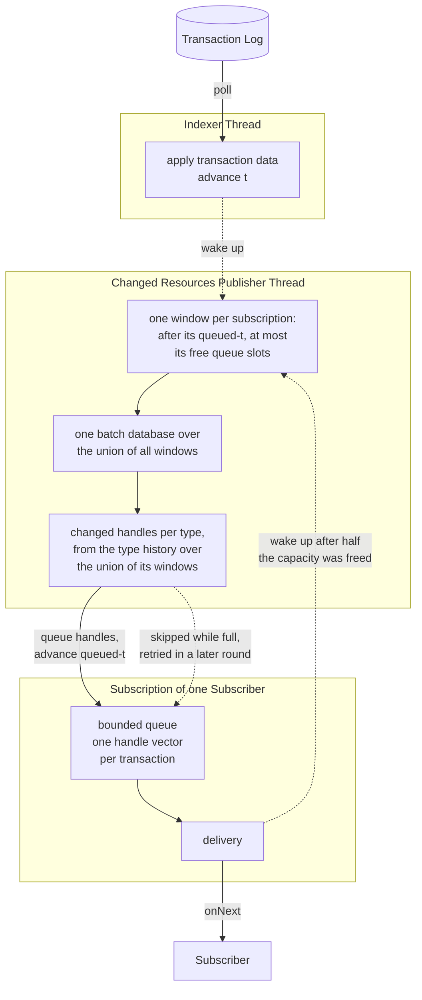
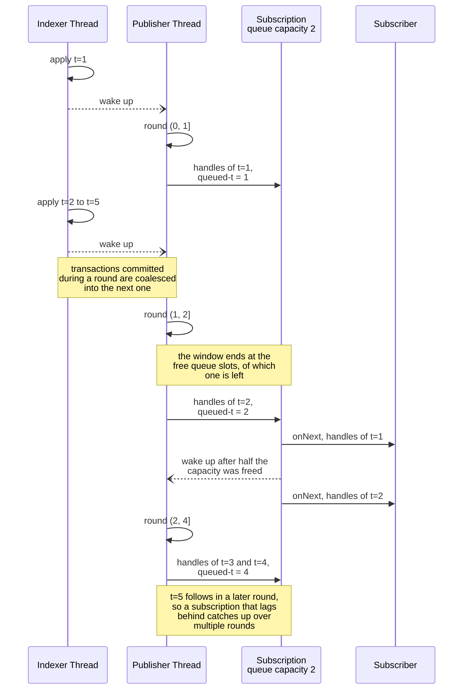

# Database Implementation

## Overview

The database architecture of Blaze is influenced by [Datomic][1] and [XTDB][2]. Both databases have a strong foundation in functional programming and [persistent data structures][3], leading to immutable databases.

## Immutable Database

The core concept behind Blaze's database is immutability. The entire database at a specific point in time is treated as a single, immutable value. The database evolves over time by transitioning from one immutable value to the next through transactions. Time is modeled explicitly, with each database value being assigned a logical timestamp `t` that increases monotonically.

```
+-------------+                   +-------------+
| Value (t=1) | -> Transaction -> | Value (t=2) |
+-------------+                   +-------------+
```

Instead of copying the entire database for each new version, Blaze uses structural sharing, a technique common in persistent data structures. This means that while each database value appears as a complete, independent snapshot from the outside, the underlying implementation is highly efficient.

> [!NOTE] 
> This contrasts with traditional relational databases, which were designed in an era of expensive storage and therefore use an update-in-place model.

A similar technique, [copy-on-write][4], is used in many areas of computing, including modern filesystems.

This immutable architecture has a significant advantage: reads do not require coordination. Because each database value can be referenced by its unique `t`, any number of queries can access the same immutable snapshot of the database over any period. When data is replicated across multiple nodes, queries can run in parallel, all accessing the same coherent database value.

For example, when paging through FHIR search results or history bundles, Blaze simply refers to the `t` of the first page to ensure that all subsequent pages are calculated against the same stable database value.

In practice, each FHIR RESTful API read request obtains the most recent database value and uses that for all queries necessary to fulfill the request.

## Logical Data Model

Blaze uses a document-based data model, similar to document stores like [MongoDB][5] and XTDB. In this model, each version of a FHIR resource is a document.

This is different from a fact-based model like Datomic's, where each fact is a triple of `(entity, attribute, value)`. While the fact-based model allows for very granular changes, it requires reconstructing larger structures like resources from individual facts. In FHIR, where updates are always whole resources, a document model is a more natural fit.

Because Blaze stores all versions of a resource, not just the current one, resources cannot be indexed solely by their logical ID. Instead, Blaze uses content hashes to identify each unique resource version. In addition to the versioned document store, several indices are used to build the database values and enable efficient queries.

## Indices

There are two main categories of indices in Blaze:

*   **Transaction Indices**: These indices depend on a database value at a specific time `t` and are used to construct the database values themselves.
*   **Search Param Indices**: These indices are independent of `t` and point directly to resource versions by their content hash, enabling efficient searching.

### Transaction Indices

| Name              | Key Parts | Value                                     |
|-------------------|-----------|-------------------------------------------|
| ResourceAsOf      | type id t | content-hash, num-changes, op, purged-at? |
| TypeAsOf          | type t id | content-hash, num-changes, op, purged-at? |
| SystemAsOf        | t type id | content-hash, num-changes, op, purged-at? |
| PatientLastChange | pat-id t  | -                                         |
| TxSuccess         | t         | instant                                   |
| TxError           | t         | anomaly                                   |
| TByInstant        | instant   | t                                         |
| TypeStats         | type t    | total, num-changes                        |
| SystemStats       | t         | total, num-changes                        |

#### ResourceAsOf

The `ResourceAsOf` index is the primary index for looking up resources. It maps a resource's identifier (`type`, `id`) and a logical timestamp `t` to the `content-hash` of that resource version. It also stores the number of changes (`num-changes`) to the resource, the operation (`op`) that created this version, and an optional `purged-at` logical timestamp.

The key is encoded as a 4-byte type id (`tid`, a hash of the resource type name), the variable-length logical `id`, and the 8-byte `t`. The `t` is encoded in descending order so that, for a given `(tid, id)` prefix, scanning the index in ascending byte order yields the newest version first. The value packs the 32-byte content hash together with an 8-byte state long that encodes `num-changes` in the upper bits and the operation (`create`, `update`, `delete`) in the lower bits, optionally followed by an 8-byte `purged-at`.

This index is used to access the version of a resource at a particular point in time `t`. To find the most current version of a resource for a given `t`, the database seeks to `(tid, id, t)` and reads the first entry whose stored `t` is less than or equal to the database's `t` — which, due to the descending encoding, is the first key encountered at or after the seek position.

Index entries with a `purged-at` logical timestamp at or before the current `t` of a database are not considered part of that database.

##### Example

The following `ResourceAsOf` index:

| Key (type, id, t) | Value (content-hash, num-changes, op) |
|-------------------|---------------------------------------|
| Patient, 0, 4     | -, 3, delete                          |
| Patient, 0, 3     | b7e3e5f8, 2, update                   |
| Patient, 0, 1     | ba9c9b24, 1, create                   |
| Patient, 1, 2     | 6744ed32, 1, create                   |

provides the basis for the following database values:

| t   | type    | id  | content-hash |
|-----|---------|-----|--------------|
| 1   | Patient | 0   | ba9c9b24     |
| 2   | Patient | 0   | ba9c9b24     |
| 2   | Patient | 1   | 6744ed32     |
| 3   | Patient | 0   | b7e3e5f8     |
| 3   | Patient | 1   | 6744ed32     |
| 4   | Patient | 1   | 6744ed32     |

The database value with `t=1` contains one patient with `id=0` and content hash `ba9c9b24`, because the second patient was created later at `t=2`. The index access algorithm will not find an entry for the patient with `id=1` on a database value with `t=1` because there is no index key with `type=Patient`, `id=1` and `t<=1`. However, the database value with `t=2` will contain the patient with `id=1` and additionally contains the patient with `id=0` because there is a key with `type=Patient`, `id=0` and `t<=2`. Next, the database value with `t=3` still contains the same content hash for the patient with `id=1` and reflects the update on patient with `id=0` because the key `(Patient, 0, 3)` is now the one with the greatest `t<=3`, resulting in the content hash `b7e3e5f8`. Finally, the database value with `t=4` doesn't contain the patient with `id=0` anymore, because it was deleted. As can be seen in the index, deleting a resource is done by adding the information that it was deleted at some point in time.

In addition to direct resource lookups, the `ResourceAsOf` index is used for listing all versions of a particular resource, all resources of a particular type, and all resources in the database. Listings are done by scanning through the index and for the non-history case, skipping versions not appropriate for the logical timestamp `t` of the database value.

#### TypeAsOf

The `TypeAsOf` index contains the same information as the `ResourceAsOf` index, but with a different key order: `type`, `t`, and `id`. This ordering is optimized for listing the history of all resources of a particular type in reverse chronological order.

#### SystemAsOf

Similarly, the `SystemAsOf` index uses the key order `t`, `type`, and `id` to provide a global, time-ordered view of all resources in the database.

#### PatientLastChange

The `PatientLastChange` index tracks all changes to resources within a patient's compartment in reverse chronological order. This allows for efficient detection of the last change in a patient's compartment, which is used by the CQL cache to invalidate cached results.

The key is composed of the raw patient `id` bytes followed by an 8-byte `t` encoded in descending order, so that for a given patient a forward seek lands on the most recent change at or before a given `t`.

#### TxSuccess

The `TxSuccess` index maps the logical timestamp `t` to the real-world `java.time.Instant` of a successful transaction. The underlying column family is configured with a reverse comparator so that an ascending scan visits the most recent transaction first — useful for finding the latest `t` on startup.

> [!NOTE] 
> Blaze is not bitemporal like XTDB. The time recorded in the history of resources is the transaction time, not a business time. This means that the history reflects the sequence of transactions as they happened and cannot be altered.

#### TxError

The `TxError` index stores information about failed transactions, including the reason for the failure.

#### TByInstant

The `TByInstant` index is the reverse of `TxSuccess`, mapping a real-world `java.time.Instant` to a logical timestamp `t`. This is used to support the `_since` parameter in history queries. Like `TxSuccess`, the column family uses a reverse comparator so that scans return the most recent instant first.

#### TypeStats

The `TypeStats` index keeps track of the total number of resources and the number of changes for each resource type at a given `t`. This is used to efficiently populate the total count in type-level search and history queries.

#### SystemStats

The `SystemStats` index does the same as `TypeStats`, but for the entire system, providing total counts for system-level queries.

### Search Param Indices

These indices are independent of `t` and are used to find resources based on their content.

| Name                                | Key Parts                                                      | Value |
|-------------------------------------|----------------------------------------------------------------|-------|
| SearchParamValueResource            | search-param, type, value, id, hash-prefix                     | -     |
| ResourceSearchParamValue            | type, id, hash-prefix, search-param, value                     | -     |
| CompartmentSearchParamValueResource | comp-code, comp-id, search-param, type, value, id, hash-prefix | -     |
| CompartmentResourceType             | comp-code, comp-id, type, id                                   | -     |
| ActiveSearchParams                  | id                                                             | -     |

#### SearchParamValueResource

The `SearchParamValueResource` index is the primary index for searching. It maps a search parameter and its value to the resources that contain that value. The key is composed of:

*   `search-param`: A 4-byte hash of the search parameter's code.
*   `type`: A 4-byte hash of the resource type.
*   `value`: The encoded value of the search parameter.
*   `id`: The logical ID of the resource.
*   `hash-prefix`: A 4-byte prefix of the resource's content hash.

The usage of this index depends on the search parameter's type.

##### Number

**TODO: continue...**

##### Date/DateTime

Search parameters of type `date` are used to search in data elements with date/time and period data types. All date types stand for an interval of a start point in time up to an end point in time. So date search uses interval arithmetic to find hits. For each value of a resource, the lower bound is encoded followed by the upper bound. Both bounds are encodes as numbers representing the seconds since epoch. UTC is used for local dates. The lower bound is separated by an null byte from the upper bound so that all resources are sorted by the lower bound first and the upper bound second.

For the different modifier, the search works the following way:

###### Equal (eq)

The value interval `v` has to intersect with the query interval `q`. In order to do so, the following must hold:
* the lower bound or upper bound of `v` is in `q`, or
* `v` completely encloses `q`.

We start by scanning through the index starting at the lower bound of `q` and ending at the upper bound of `q`. After that, we repeat the same process with the upper bound prefix, not adding any duplicates.

###### Less Than or Equal

**TODO: continue...**

###### Example

| search-param | type        | value                  | id | hash-prefix |
|--------------|-------------|------------------------|----|-------------|
| date         | Observation | 2025-01-01, 2025-01-31 | 1  | 6744ed32    |
| date         | Observation | 2025-02-01, 2025-02-28 | 2  | b7e3e5f8    |
| date         | Observation | 2025-03-01, 2025-03-31 | 1  | ba9c9b24    |

Search for `2025` results in the index handles `[1, [6744ed32]]`, `[2, [b7e3e5f8]]` and `[1, [ba9c9b24]]`. Note that the index handles are not distinct and not ordered.

##### String

**TODO: continue...**

##### Token

Search parameters of type `token` are used for exact matches of codes and identifiers. To support various search syntaxes, the value is encoded in four ways:

*   `code`: The code without system.
*   `system|code`: The code scoped by the system.
*   `|code`: The code if the resource doesn't specify a system.
*   `system|`: The system independent of the code, used to find all resources with any code in that system.

These strings are then hashed using the 32-bit [Murmur3][7] algorithm to create a fixed-length value, saving space and improving performance.

###### Example

For this example, we don't use the hashed versions of the key parts except for the content-hash.

| Key (search-param, type, value, id, content-hash) |
|---------------------------------------------------|
| gender, Patient, female, 1, 6744ed32              |
| gender, Patient, female, 2, b7e3e5f8              |
| gender, Patient, male, 0, ba9c9b24                |

In case one searches for female patients, Blaze will seek into the index with the key prefix (gender, Patient, female) and scan over it while the prefix stays the same. The result will be the `[id, hash]` tuples:
* `[1, 6744ed32]` and
* `[2, b7e3e5f8]`.

That tuples are further processed against the `ResourceAsOf` index in order to check whether the resource versions are valid regarding to the current `t`.

| search-param | type        | value       | id | hash-prefix |
|--------------|-------------|-------------|----|-------------|
| status       | Observation | preliminary | 1  | 6744ed32    |
| status       | Observation | preliminary | 1  | ba9c9b24    |
| status       | Observation | final       | 1  | b7e3e5f8    |

Search for `preliminary` results in an index handle of `[1 [6744ed32 ba9c9b24]]`. Search for `final` results in an index handle of `[1 [b7e3e5f8]]`. The union will give a index handle of `[1 [6744ed32 b7e3e5f8 ba9c9b24]]`.

##### Reference

**TODO: continue...**

##### Composite

**TODO: continue...**

##### Quantity

**TODO: continue...**

##### URI

**TODO: continue...**

##### Special

**TODO: continue...**

#### ResourceSearchParamValue

The `ResourceSearchParamValue` index is used to verify if a resource contains a specific search parameter value. Its key is ordered by resource (`type`, `id`, `hash-prefix`) first, then by search parameter and value.

#### CompartmentSearchParamValueResource

This index is used to find resources within a specific compartment that match a given search parameter value.

#### CompartmentResourceType

This index is used to find all resources of a specific type that belong to a given compartment. The components of its key are:

* `comp-code` - a 4-byte hash of the compartment code, ex. `Patient`
* `comp-id` - the logical id of the compartment, ex. the logical id of the Patient
* `type` - a 4-byte hash of the resource type of the resource that belongs to the compartment, ex. `Observation`
* `id` - the logical id of the resource that belongs to the compartment, ex. the logical id of the Observation

#### ActiveSearchParams

This column family is reserved for tracking the set of active search parameters but is currently not used. The set of available search parameters is built in memory at startup by the search parameter registry from the bundled FHIR `SearchParameter` resources, not from this index.

## Transaction Handling

1.  A transaction bundle is POSTed to an arbitrary node.
2.  This node submits the transaction commands to a central transaction log.
3.  All nodes (including the submitting node) receive the transaction commands from the log and apply them to their local state.

### Submit-Time Admission Control

The node is the only place a transaction is turned away. The transaction log accepts whatever is submitted to it, so a transaction the node decided to go ahead with is on its way to being indexed.

The node makes that decision before it writes anything, by limiting the number of *in-flight* transactions — submitted but not yet indexed — to `DB_MAX_IN_FLIGHT_TRANSACTIONS`. A submit that finds no free place returns a busy anomaly, leaving the resource store and the transaction log untouched. A submit that takes one goes on to write its resource contents into the resource store and only then its commands into the transaction log, because every node applying the transaction has to be able to read those contents. The place is freed once the transaction was indexed, or right away if the transaction never made it into the transaction log, because storing its contents or submitting its commands failed.

That limit is what bounds the memory of the in-memory buffer of the [local transaction log](../architecture.md#transaction-log): the buffer only retains transaction data the poller hasn't acknowledged yet, and the poller acknowledges everything it has indexed. Because the limit is enforced per node, it applies to a Kafka transaction log as well, where it bounds how far a node's own submissions can run ahead of its indexing.

### Apply-Time Mechanics

A transaction is applied to the local index in three layers, ordered so that the visibility-gating row (`TxSuccess`) is the last thing written:

1.  **Search-parameter indexing — parallel, one WriteBatch per resource.** The resource indexer (`modules/db/src/blaze/db/node/resource_indexer.clj`) fans out across an executor pool: each resource in the transaction is indexed independently and its `SearchParamValueResource`, `ResourceSearchParamValue`, `CompartmentSearchParamValueResource`, and `CompartmentResourceType` entries are written as a per-resource `WriteBatch`. These batches commit in parallel and out of order with respect to each other.
2.  **Transaction index entries — one WriteBatch.** Once the tx-indexer (`modules/db/src/blaze/db/node/tx_indexer.clj`) has verified the transaction against `db-before`, the resulting entries for `ResourceAsOf`, `TypeAsOf`, `SystemAsOf`, `PatientLastChange`, `TypeStats`, and `SystemStats` are written in a single `WriteBatch`. This batch is written *before* the search-param futures are joined.
3.  **Transaction success marker — one WriteBatch.** After the search-param futures complete, `TxSuccess` and `TByInstant` are written in a final `WriteBatch`. The head of `TxSuccess` is the authoritative current `t` of the local database value; rows in earlier-written CFs with a higher `t` are not yet visible to readers.

If the tx-indexer rejects the transaction (e.g. referential integrity, version mismatch), a `TxError` entry is written instead and steps 2 and 3 are skipped. The parallel search-param batches kicked off in step 1 are *not* cancelled — any that have already committed leave entries behind. These entries are inert: they carry a `hash-prefix` tied to a content hash that no `ResourceAsOf` row references, and reads always start from `ResourceAsOf`. They are never reached by queries and are not garbage-collected.

A crash between the step 2 batch and the step 3 batch produces a similar situation at the transaction level: `ResourceAsOf` (and the other AsOf indices) carry rows at some `t > head(TxSuccess)`. Startup uses `head(TxSuccess)` as the current `t`, so those rows are invisible until — and unless — the same transaction is re-applied from the log and the step 3 batch lands.

### Changed Resources Publishing

Each node runs two threads, plus one thread per subscriber. The **indexer thread** polls the transaction log and applies the transaction data as described above. The **changed resources publisher thread** determines the resource handles changed in each transaction and queues them into the subscription of each interested subscriber. The **thread of each subscription** delivers the queued handles to its subscriber, one delivery per transaction, in transaction order.

Components inside Blaze subscribe to the changed resources of a resource type in order to react to changes made on any node of a distributed cluster. The job scheduler uses it to pick up `Task` resources, and the page id cipher uses it to pick up rotated keys.



All threads run independently of each other:

*   A transaction is visible in database values as soon as it is indexed, independent of whether it was already published. Publishing never slows indexing down, so it also never slows down the response time of the FHIR RESTful API requests submitting the transactions.
*   Publishing can lag behind indexing, either because determining the changed handles takes long or because a subscriber doesn't consume fast enough. Transactions committed while a publishing round is in progress are coalesced into the next round, so that the changed handles of multiple transactions are determined with a single database value. That lag is exposed per resource type and subscriber as two metrics. `blaze_db_node_publishing_lag_transactions` is the number of transactions whose changed handles were queued but not delivered yet, so it is bounded by the queue capacity. `blaze_db_node_publishing_lag_t` is the distance in `t` between the last transaction the node indexed and the point in time up to which transactions were examined for the subscriber, which is unbounded. That distance is an upper bound on the transactions the subscriber still receives handles for, not a count of them: it spans the failed transactions, which change no resources at all, and the successful ones that changed no resource of the type of the subscriber. How many of them there are is exactly what determining the changed handles finds out, so it isn't known before a transaction was examined.

Each subscription owns a bounded queue and tracks its **queued-t**, the point in time up to which all transactions were examined for its subscriber. The publisher thread never blocks: it skips a subscription whose queue is full, retrying in a later round. The thread of a subscription wakes the publisher thread up after it freed half the capacity of its queue, so a retry doesn't depend on the next transaction to happen. Waking it up at the first free slot instead would degenerate a subscription that lags behind into one round per delivered transaction. That's why a single publisher thread is sufficient, no matter how many subscribers exist.

A round determines the changed handles per **window** of transactions, bounded on both ends. The window of a subscription starts after its queued-t and ends at its free queue slots at the latest, because the handles of more transactions can't be queued into it anyway. So a subscription that lags behind catches up over multiple rounds instead of every round examining all transactions it lags behind, and no round determines handles it has to drop again. Both bounds keep the work and the memory of a single round proportional to the queue capacity instead of to the lag.

The following rounds of a subscription with a queue capacity of two show how both bounds play out over time:



All windows of a round are served by a **single batch database** — one snapshot of the key-value store — spanning their union, no matter how far apart the subscriptions are. Inside it, the type history of a type is examined only over the union of the windows of its own subscriptions, so that a subscription that lags behind doesn't make the history of the types of the subscriptions that are caught up be examined from its own queued-t.

This isolates the subscribers from each other in two ways. A subscriber that doesn't consume fast enough only fills up its own queue, while the other subscribers still receive their handles. And a subscriber that blocks in its delivery method only blocks the thread of its own subscription. Closing a node is never delayed by a subscriber that doesn't consume, only by a delivery already in progress.

Publishing is lossless as long as the node runs. Because the subscribers are essential parts of Blaze, a subscriber that doesn't consume fast enough is never dropped and transactions are never skipped in order to catch up — the handles stay queued and the queued-t doesn't advance beyond them. A permanently growing `blaze_db_node_publishing_lag_t` means a subscriber is stuck and should be alerted on. Its `blaze_db_node_publishing_lag_transactions` sitting at the queue capacity tells that the subscriber itself is the one that doesn't consume, while a distance growing with an empty queue points at the publisher instead.

Closing the node is the one point at which transactions are lost. Because closing doesn't wait for a subscriber that doesn't consume, the publisher thread stops after the last round that had space, leaving a subscription with a full queue behind at its queued-t. Closing then drops what that subscription didn't deliver yet — the queued handles and the transactions after its queued-t — before its subscriber receives onComplete. Both are logged as a warning naming the subscriber: the queued handles as the number of transactions lost, the ones after the queued-t as the range of `t` they span, because they were never examined, so how many of them changed resources of the type isn't known and can't be found out anymore. That range is also what tells the point in time the subscriber is up to date to.

Delivery stops at that point instead of draining the queue, because a delivery is subscriber code: the job scheduler starts jobs from it and transacts, the page id cipher reads resources. Running that after the node was closed would race the shutdown of the components the node depends on, and a transaction submitted then would never be indexed, because the indexing loop has already stopped. For the same reason, a closed node rejects transactions with an `unavailable` anomaly, and futures waiting for a `t` that will never be indexed — from `tx-result` or `sync` — complete exceptionally instead of waiting forever. Only a delivery that is already in progress finishes, since its handles left the queue before closing. Closing waits for it, after the indexer and the publisher thread stopped, because returning while a subscriber still queries the node would let Integrant shut down the key-value and resource stores under it. Dropping the queues is what bounds that wait to a single delivery per subscription.

A subscriber that cancels its subscription is dropped, because a cancelled subscriber doesn't receive any signal anymore. Continuing to publish to it would silently discard the handles of all following transactions instead of exposing them as publishing lag. The same happens to a subscriber whose delivery method throws, because a subscriber that can't process the handles of one transaction can't process the following ones either. It receives that error.

A subscriber that throws while it receives its subscription is never subscribed at all. Such a subscriber can't receive that error, because the reactive streams spec considers its subscription as cancelled, so the error is thrown back at the component subscribing instead. Since the subscribers of Blaze subscribe while they are initialized, this fails the start of the system rather than leaving that component running with a subscription that never delivers anything.

Determining the changed handles is not optional. If it fails, the node stops in the same way it stops on an indexing error, because continuing would leave the subscribers with a silent gap. Subscribers receive onError in that case and onComplete after the node was closed.

### Closing a Node

Closing a node stops its indexing loop and then waits, in this order, for the indexer thread to exit, for the publisher thread to exit and for the last delivery of each subscription. None of these waits is bounded by a timeout, and there is consequently no shutdown timeout to configure.

The indexer thread finishes the transaction it is currently applying before it exits, and applying a transaction waits for the search-parameter indexing of step 1 above. With `STORAGE=distributed` that is a wait on the external resource store, so a store that doesn't answer keeps the node from closing and the container is eventually killed by its runtime.

That's deliberate. Blaze doesn't optimize for a graceful shutdown in every situation, because it has to survive being killed anyway. The transaction log is the source of truth and the apply-time mechanics above are built so that a process dying at an arbitrary point comes back with a consistent local index and re-applies whatever didn't finish. A kill during shutdown is just another crash.

A timeout wouldn't make such a shutdown clean, only late and then unsafe. Returning from closing while the indexer thread or a subscriber still runs lets Integrant shut down the key-value and resource stores under that code, which is exactly what the waits exist to prevent. So bounding them would trade a shutdown that hangs — and is then killed, leaving recoverable state — for one that returns and runs indexing or subscriber code against half-stopped components. Waiting without a bound is the safer of the two.

### Node Failure

A node fails if anything escapes the loop of its indexer thread or the loop of its publisher thread. That is about the machinery, not about a single transaction: a transaction the tx-indexer rejects is ordinary operation and is committed as a `TxError` as described above. A node fails when applying or publishing itself can't continue.

Exceptions of the key-value store are part of that set. Blaze doesn't catch `RocksDBException` on the read and write path — only the property lookups of the RocksDB module convert it into an anomaly — so a store that fails while a transaction is applied or while the changed handles of a publishing round are determined propagates up to the loop and fails the node. That is intentional. A store that just threw leaves the state of the local index unknown, and there is no altitude below the node at which continuing would be safe.

A failed node remembers that it failed and stops its indexing loop:

*   `submit-tx` fails every transaction from then on with an `unavailable` anomaly stating that the node stopped because of an unrecoverable error.
*   Futures waiting for a `t` — from `tx-result` or `sync` — fail with that same anomaly instead of waiting for a transaction that will never be indexed. This includes the caller of the transaction whose indexing failed. That transaction is stored durable in the transaction log and will be indexed at the next start, so there is nothing more to tell that caller either.
*   The publisher thread exits and closes all subscriptions with that anomaly, so every subscriber receives onError.
*   Reads keep working. Database values are still served, but at the `t` of the last indexed transaction, so the local index is frozen and silently ages from that point on.

What a node does **not** keep is the error that failed it. That error is logged as `Error while indexing` or `Error while publishing changed resources`, together with its stack trace, and goes nowhere else. It can come from any depth of the node — an exception of the key-value store for example — so handing it to callers would expose internals of the server, stack trace included, to arbitrary clients, and would keep doing so for every request until the node is restarted. Nothing needs it there: the log line has the error together with its context, while a caller only has to learn that the node stopped and that retrying won't help. Ordinary transaction errors are unaffected by this, because they are committed as `TxError` and reported to their caller as described above — only a node that failed reports a general anomaly.

Rejecting transactions with `unavailable` rather than a fault is deliberate. The node can't accept transactions anymore, which is the same situation a closed node is in, and the FHIR RESTful API turns it into a `503`.

This state is permanent. Nothing retries, and the node is never brought back — recovery is a restart of the process. That is the same reasoning as for closing a node above: the transaction log is the source of truth and the apply-time mechanics are built so that a process dying at an arbitrary point comes back with a consistent local index and re-applies whatever didn't finish. So restarting is a path Blaze has to support anyway, while continuing on a store whose state is unknown, or after a publishing round that failed, isn't. A node that keeps accepting transactions in that situation would trade an outage that is recoverable for an index that quietly diverges, and one that keeps publishing would leave the subscribers with a gap they can't detect.

That altitude is deliberate and doesn't extend downwards. An error of a single subscription — a subscriber whose delivery method throws — concerns neither the node nor the other subscribers and only ends that subscription, as described above. The indexer and publisher threads are shared by everything the node does, which is why a failure there fails the node.

## Transaction Commands

Blaze supports several transaction commands:

*   **`create`**: Creates a new resource.
*   **`put`**: Creates or updates a resource.
*   **`keep`**: An optimized `put` for cases where the resource is unlikely to have changed.
*   **`delete`**: Deletes a resource.
*   **`conditional-delete`**: Deletes resources based on search criteria.
*   **`delete-history`**: Deletes the history of a resource.
*   **`patient-purge`**: Removes all data associated with a patient.

### Create

The `create` command is used to create a resource.

#### Properties

| Name          | Required | Data Type     | Description                                     |
|---------------|----------|---------------|-------------------------------------------------|
| type          | yes      | string        | resource type                                   |
| id            | yes      | string        | resource id                                     |
| hash          | yes      | hash          | resource content hash                           |
| refs          | no       | list          | references to other resources                   |
| if-none-exist | no       | search-clause | will only be executed if search returns nothing |

### Put

The `put` command is used to create or update a resource.

#### Properties

| Name          | Required | Data Type     | Description                                 |
|---------------|----------|---------------|---------------------------------------------|
| type          | yes      | string        | resource type                               |
| id            | yes      | string        | resource id                                 |
| hash          | yes      | hash          | resource content hash                       |
| refs          | no       | list          | references to other resources               |
| if-match      | no       | number        | the t the resource to update has to match   |
| if-none-match | no       | "*" or number | the t the resource to update must not match |

### Keep

The `keep` command can be used instead of a `put` command if it's likely that the update of the resource will result in no changes. In that sense, the `keep` command is an optimization of the `put` command that has to be retried if it fails.

#### Properties

| Name     | Required | Data Type | Description                                                   |
|----------|----------|-----------|---------------------------------------------------------------|
| type     | yes      | string    | resource type                                                 |
| id       | yes      | string    | resource id                                                   |
| hash     | yes      | hash      | the resource content hash the resource to update has to match |
| if-match | no       | number    | the t the resource to update has to match                     |

### Delete

The `delete` command is used to delete a resource.

#### Properties

| Name       | Required | Data Type | Description                      |
|------------|----------|-----------|----------------------------------|
| type       | yes      | string    | resource type                    |
| id         | yes      | string    | resource id                      |
| check-refs | no       | boolean   | use referential integrity checks |

### Conditional Delete

The `conditional-delete` command is used to delete possibly multiple resources by selection criteria.

#### Properties

| Name           | Required | Data Type | Description                                      |
|----------------|----------|-----------|--------------------------------------------------|
| type           | yes      | string    | resource type                                    |
| clauses        | no       | string    | clauses to use to search for resources to delete |
| check-refs     | no       | boolean   | use referential integrity checks                 |
| allow-multiple | no       | boolean   | allow deleting multiple resources                |

### Delete History

The `delete-history` command is used to delete the history of a resource.

#### Properties

| Name       | Required | Data Type | Description                      |
|------------|----------|-----------|----------------------------------|
| type       | yes      | string    | resource type                    |
| id         | yes      | string    | resource id                      |

#### Execution

* get all instance history entries
* add the `t` of the transaction as `purged-at?` to the value of each of the history entries not only in the ResourceAsOf index, but also in the TypeAsOf and SystemAsOf index
* remove the number of history entries purged from the number of changes of `type` and the whole system

### Patient Purge

The `patient-purge` command is used to remove all current and historical versions for all resources in a patient compartment.

#### Properties

| Name       | Required | Data Type | Description                      |
|------------|----------|-----------|----------------------------------|
| id         | yes      | string    | patient id                       |
| check-refs | no       | boolean   | use referential integrity checks |

## Queries

### Type Query

A type query retrieves all resources of a specific type that match a set of search parameter clauses. The execution of a type query is a two-phase process: query planning and query execution.

#### Query Planning

The goal of the query planning phase is to find the most efficient way to execute the query. This is done by splitting the search parameter clauses into two groups:

*   **SCANS**: A small set of clauses that will be used to scan an index.
*   **SEEKS**: The remaining clauses that will be used to filter the results from the scan.

The query planner tries to find the clause with the highest selectivity for the `SCANS` group. The selectivity of a clause is determined by the type of the search parameter and the values being searched for.

Generally, search parameters of type `token` are good candidates for `SCANS` because they often have a high selectivity. Other types like `date` or `quantity` are usually placed in the `SEEKS` group.

If a query contains multiple `token` search parameters, the query planner estimates the size of the index segment that needs to be scanned for each of them. The clause with the smallest estimated scan size is chosen for the `SCANS` group. Other `token` clauses might be added to the `SCANS` group if their estimated scan size is not much larger than the smallest one.

#### Query Execution

After the query planning is complete, the query is executed. The execution distinguishes between index scans and index seeks.

##### Index Scan

The query execution starts by scanning the `SearchParamValueResource` index for all **index handles** that match the clauses in the `SCANS` group. An index handle is a lightweight pointer to a resource, containing the resource ID and a collection of hash prefixes. This is a continuous read of a segment of the index, resulting in a stream of index handles.

###### Union and Intersection of Scans

The index scan becomes more complex if multiple values are supplied for one search parameter or if multiple search parameters are used for the scan.

*   **Union of Scans (Logical OR)**: If a search parameter in the `SCANS` group has multiple values (e.g. `(d/type-query db "Patient" [["gender" "male" "female"]])`), the query execution will perform an index scan for each value. The individual streams of index handles are then combined into a single stream by a **stream union** operation. The resulting stream contains all index handles from all scans, with duplicates removed.

*   **Intersection of Scans (Logical AND)**: If there are multiple search parameters in the `SCANS` group (e.g. `(d/type-query db "Observation" [["status" "final"] ["code" "..."]])`), the query execution will perform an index scan for each search parameter. The individual streams of index handles are then combined into a single stream by a **stream intersection** operation. The resulting stream contains only those index handles that are present in all scanned streams.

##### Index Seek

For each **index handle** from the index scan, the query execution will then check if it also matches the clauses in the `SEEKS` group. This is also done using index seeks, but instead of looking up values in the `SearchParamValue-Resource` index, it uses the `ResourceSearchParamValue` index to efficiently verify if a given resource (represented by its index handle) has the required values for the `SEEKS` clauses.

A scan is more performant than many individual seeks. Therefore, the query planner tries to minimize the number of seeks by selecting the most specific clause for the scan, which will produce the smallest number of index handles that need to be checked in the second phase.

Finally, the index handles that survive the filtering process are converted into full **resource handles**. A resource handle is a more detailed pointer to a resource version, containing not only the resource ID and hash, but also the logical timestamp `t` of that version. This conversion requires an additional seek into the `ResourceAsOf` index for each index handle. This final seek is crucial because it guarantees that the returned resources are consistent with the state of the database at the specific point in time (`t`) of the query.

#### Example

Consider the following query:

```clojure
(d/type-query db "Observation" [["status" "final"] ["code" "http://loinc.org|9843-4"]])
```

Both `status` and `code` are `token` search parameters. The query planner will estimate the number of Observation resources with `status=final` and the number of Observation resources with `code=http://loinc.org|9843-4`. Let's assume that there are far fewer observations with that specific LOINC code than observations with the status `final`.

The query plan will be:

*   **SCANS**: `code=http://loinc.org|9843-4`
*   **SEEKS**: `status=final`

The query execution will then:

1.  Scan the `SearchParamValueResource` index for all Observation **index handles** with `code=http://loinc.org|9843-4`.
2.  For each of these **index handles**, it will perform a seek in the `ResourceSearchParamValue` index to check if the resource has a `status` of `final`.
3.  The surviving **index handles** are then converted to **resource handles**.

This is much more efficient than scanning all observations with `status=final` and then checking the code for each of them.

## RocksDB Details

RocksDB is used for all three databases (index, transaction, and resource) in the standalone storage variant, and for the index database in the distributed variant.

## WAL Sync Strategy

RocksDB uses a Write-Ahead Log (WAL) to enable recovery of unflushed memtables after a crash. WAL writes can be configured as either synced or unsynced. In unsynced mode, writes go only to the OS page cache, and the OS determines when to persist them to disk. This mode risks data loss in the event of a server crash.

Blaze enables WAL sync for the transaction and resource databases in standalone mode to ensure durability. WAL sync is disabled for the index database to optimize write performance. If writes to the index database are lost due to a crash, Blaze automatically re-indexes the missing transactions on the next startup. This design is safe because Blaze treats the transaction database as an application-level WAL. The transaction and resource databases together contain all data needed to reconstruct the index database.   

[1]: <https://www.datomic.com>
[2]: <https://xtdb.com>
[3]: <https://en.wikipedia.org/wiki/Persistent_data_structure>
[4]: <https://en.wikipedia.org/wiki/Copy-on-write>
[5]: <https://www.mongodb.com>
[6]: <https://www.hl7.org/fhir/search.html#token>
[7]: <https://en.wikipedia.org/wiki/MurmurHash>
