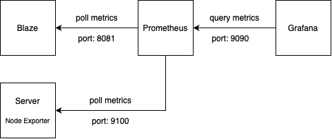
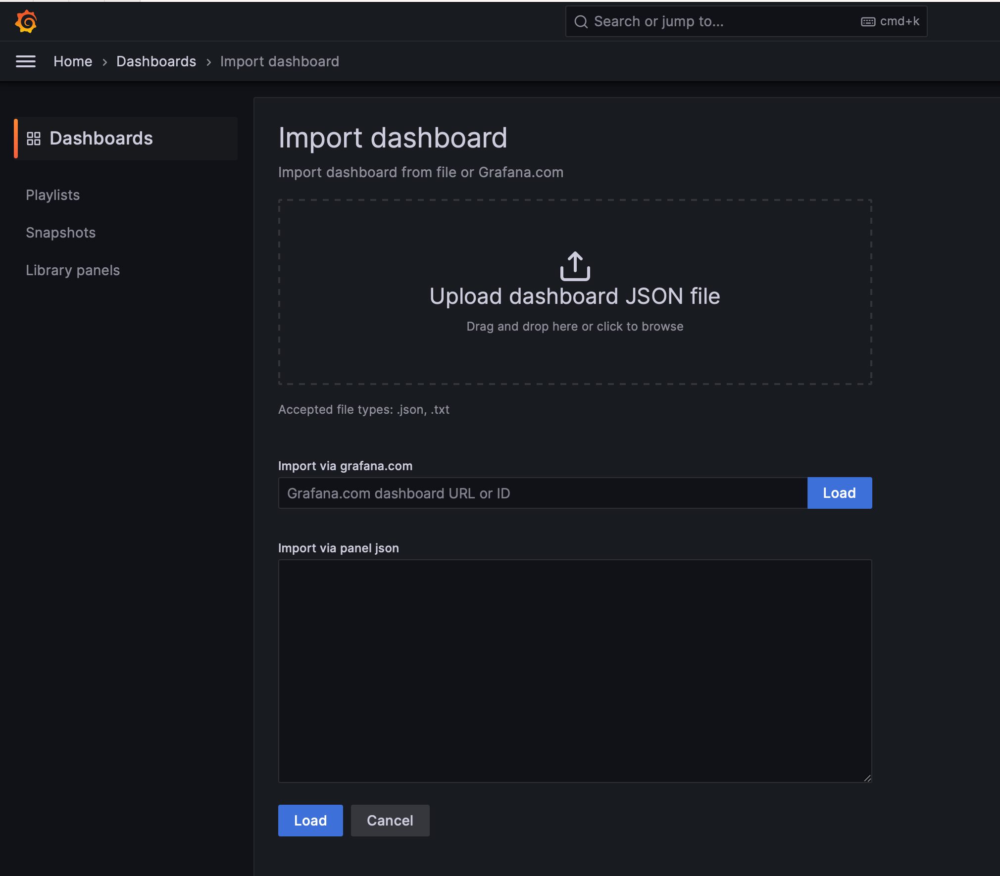
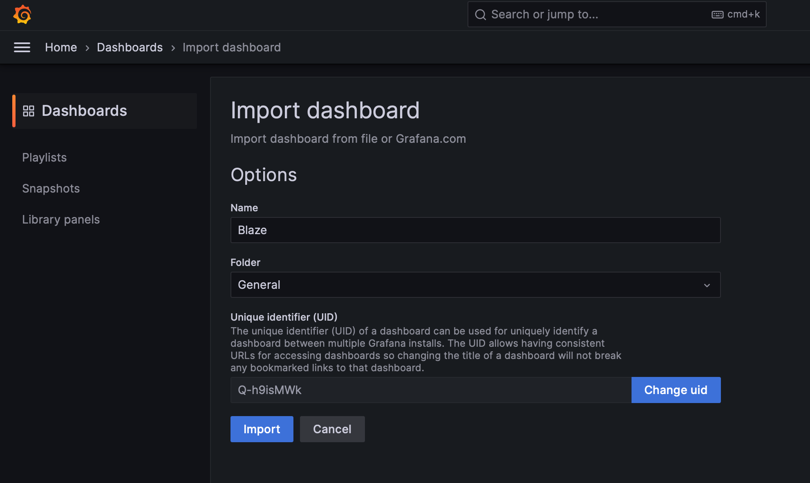
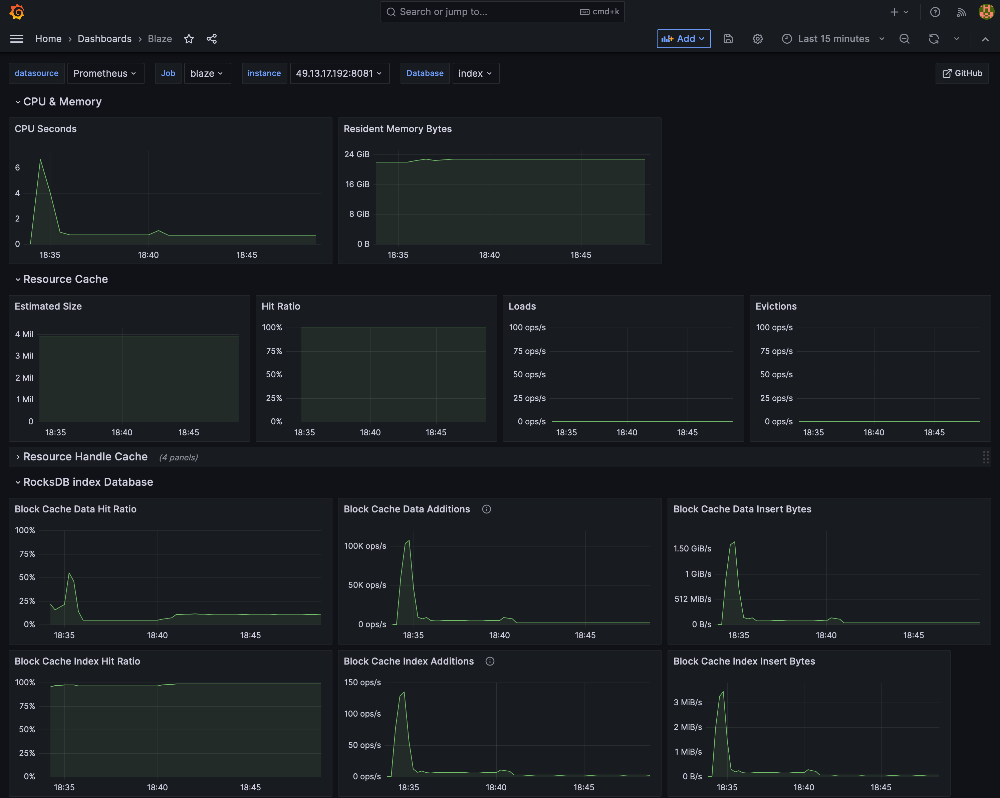

# Monitoring

It's recommended to use [Prometheus][1] and [Grafana][2] to monitor the runtime behaviour of Blaze and of the server Blaze runs on.



## Prometheus Config

A basic Prometheus config looks like this:

```yaml
global:
  scrape_interval: 15s

scrape_configs:
- job_name: 'node'
  static_configs:
  - targets: ['<server-ip-addr>:9100']
  - labels:
      instance: 'blaze'

- job_name: 'blaze'
  static_configs:
  - targets: ['<server-ip-addr>:8081']
  - labels:
      instance: 'blaze'
```

## Import the Blaze Dashboard

In order to import the Blaze dashboard into your Grafana instance, please copy the contents of [blaze.json](monitoring/blaze.json) and pate it into the import dialog on the Import dashboard site:



After that, please click "Import" on the next site:



After the Import, the Blaze dashboard should look like this:



## Node Exporter for the Server

The Prometheus [Node Exporter](https://github.com/prometheus/node_exporter) should be used to gather metrics about the server Blaze is hosted on.

### Dashboards

* [Node Exporter Full](https://grafana.com/grafana/dashboards/1860-node-exporter-full/)

[1]: <https://prometheus.io>
[2]: <https://grafana.com>
