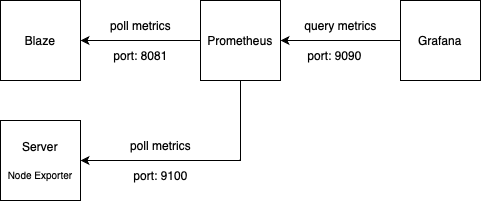
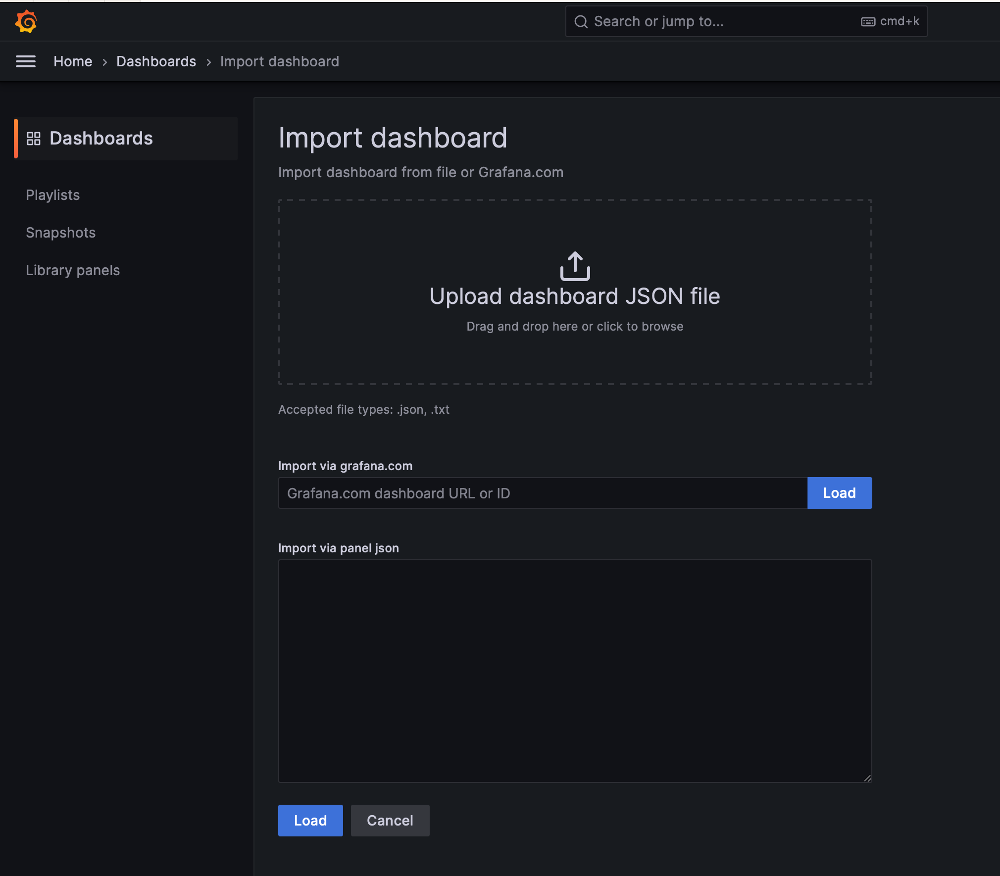
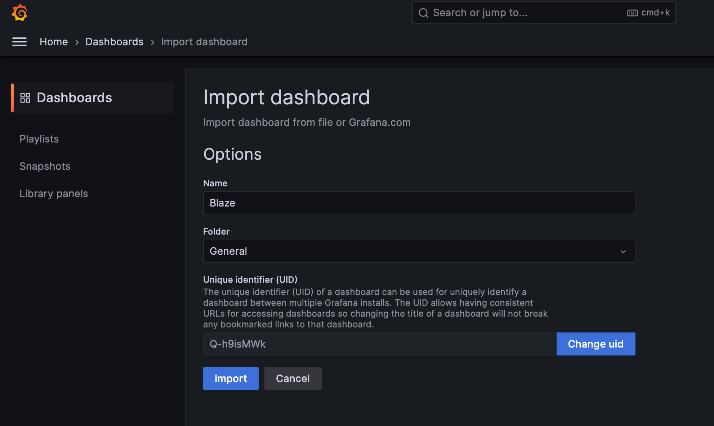
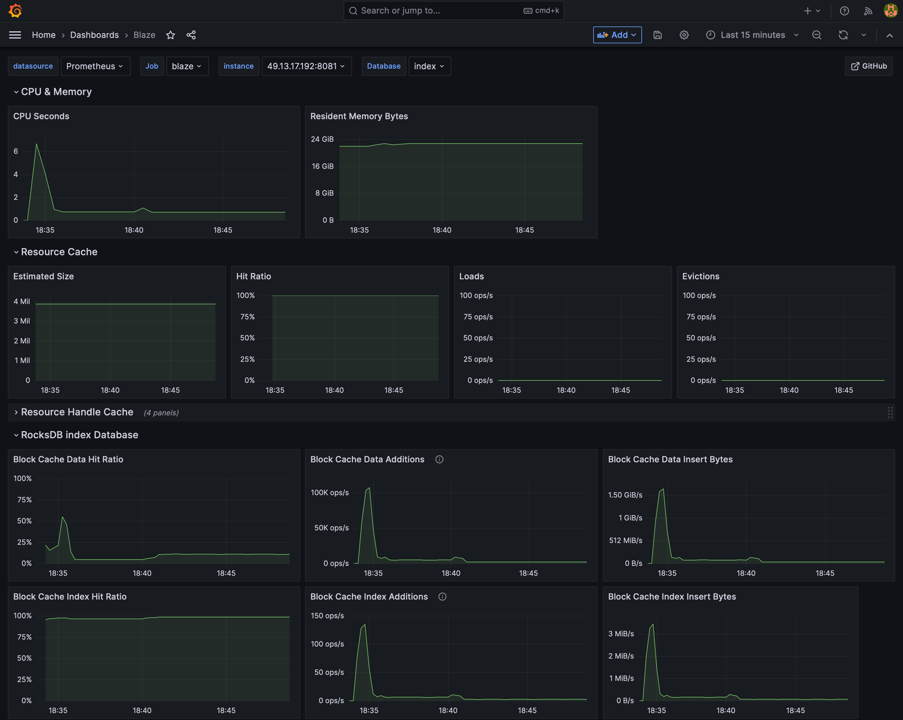

<script setup lang="ts">
  const release = import.meta.env.VITE_LATEST_RELEASE;
  const dashboardUrl = `https://github.com/samply/blaze/releases/download/${release}/blaze-dashboard.json`;
</script>

# Monitoring

It's recommended to use [Prometheus][1] and [Grafana][2] to monitor the runtime behaviour of Blaze and of the server Blaze runs on.



## Prometheus Config

A basic Prometheus config looks like this:

```yaml
global:
  scrape_interval: 15s

scrape_configs:
- job_name: 'node'
  static_configs:
  - targets: ['<server-ip-addr>:9100']
  - labels:
      instance: 'blaze'

- job_name: 'blaze'
  static_configs:
  - targets: ['<server-ip-addr>:8081']
  - labels:
      instance: 'blaze'
```

## Import the Blaze Dashboard

The Blaze dashboard is published as a release asset. Please download <a :href="dashboardUrl">blaze-dashboard.json</a> and upload it in the import dialog on the Import dashboard site:



After that, please click "Import" on the next site:



After the Import, the Blaze dashboard should look like this:



The dashboard is generated from [modules/monitoring/dashboard.edn][3]. Maintainers change that file and not the exported JSON. The generated JSON is checked in CI with the [Grafana dashboard linter][4], configured in [modules/monitoring/.lint][5].

## Node Exporter for the Server

The Prometheus [Node Exporter](https://github.com/prometheus/node_exporter) should be used to gather metrics about the server Blaze is hosted on.

### Dashboards

* [Node Exporter Full](https://grafana.com/grafana/dashboards/1860-node-exporter-full/)

[1]: <https://prometheus.io>
[2]: <https://grafana.com>
[3]: <https://github.com/samply/blaze/blob/main/modules/monitoring/dashboard.edn>
[4]: <https://github.com/grafana/dashboard-linter>
[5]: <https://github.com/samply/blaze/blob/main/modules/monitoring/.lint>
