# CQL Performance

## TL;DR

For the CQL queries analyzed here, the relative performance of query evaluation in patients/s stays the same for datasets with 1 million patients compared to datasets with 100 thousand patients if the system resources are sufficient and Blaze performs equally or better for datasets with more patient history. In all cases the performance increases with rising system resources.  

## Systems

The following systems were used for performance evaluation:

| System | Provider | CPU        | Cores |     RAM |    SSD | Heap Mem | Block Cache | Resource Cache ¹ |
|--------|----------|------------|------:|--------:|-------:|---------:|------------:|-----------------:|
| LEA25  | on-prem  | EPYC 7543P |     4 |  32 GiB |   2 TB |    8 GiB |       8 GiB |            2.5 M | 
| LEA36  | on-prem  | EPYC 7543P |     8 |  64 GiB |   2 TB |   16 GiB |      16 GiB |              5 M | 
| LEA47  | on-prem  | EPYC 7543P |    16 | 128 GiB |   2 TB |   32 GiB |      32 GiB |             10 M | 
| LEA58  | on-prem  | EPYC 7543P |    32 | 256 GiB |   2 TB |   64 GiB |      64 GiB |             20 M | 

¹ Size of the resource cache (DB_RESOURCE_CACHE_SIZE)

## Datasets

The following datasets were used:

| Dataset | History  | # Pat. ¹ | # Res. ² | # Obs. ³ | Disc Size |
|---------|----------|---------:|---------:|---------:|----------:|
| 100k    | 10 years |    100 k |    104 M |     59 M |   202 GiB |
| 100k-fh | full     |    100 k |    317 M |    191 M |   323 GiB |
| 1M      | 10 years |      1 M |   1044 M |    593 M |  1045 GiB |

¹ Number of Patients, ² Total Number of Resources, ³ Number of Observations

The creation of the datasets is described in the [Synthea section](./synthea/README.md). The disc size is measured after full manual compaction of the database.

## Metric

The metric analyzed here are the number of patients a system can process per second. It was chosen because the CQl evaluation performance depends heavily on the number of patients available in Blaze. The datasets contain either 100 k or 1 million patients in order to represent two relevant sizes from where an interpolation or extrapolation towards the target size should be possible. The metric patients per second itself is idenpendend from the actual number of patients and so can be used to compare the two sizes analysed here.

With a given patients per second value, its always possible to calculate the to be expected CQL evaluation duration by dividing the target systems number of patients by that number. So for example, if the metric is 100 k patients/s Blaze will need 1 second if it contains 100 k patients and 5 seconds if it contains 500 k patients.

## Simple Code Search

In this section, CQL queries for selecting patients which have observations with a certain code are analyzed. The codes were chosen to produce a wide range of hits (number of matching patients). For the 100k dataset the hits are 2 k, 60 k and 100 k, for the 100k-fh dataset the hits are 2 k, 57 k and 100 k and for the 1M dataset the hits are 25 k, 603 k and 998 k.


The first chart shows the results for the 100k dataset. It shows that the performance raises with the system size and declines a bit with the number of patients found. This decline can be explained because it is more costly to find the observations that are responsible for the patient match as to find no observations.

 

The second bar chart shows the results for the 100k-fh dataset which differs by the 100 k dataset in that it contains a full history of patient data instead of a history capped at 10 years. Especially the number of observations is 191 M compared to only 59 M in the 100k dataset. Comparing the two bar charts, the performance is nearly identical. So for simple code search, the performance doesn't depend on the amount of patient history. 


The third bar chart shows the results for the 1M dataset. For the two bigger systems LEA47 and LEA58, the relative performance measured in patients per second is identical to the performance Blaze shows at the smaller datasets with only 100 k patients. However the same can't be said for the two smaller systems LEA25 and LEA36, were the relative performance suffers due to memory limitations of that systems. 

### Charts Comparing the Datasets

#### System - LEA25

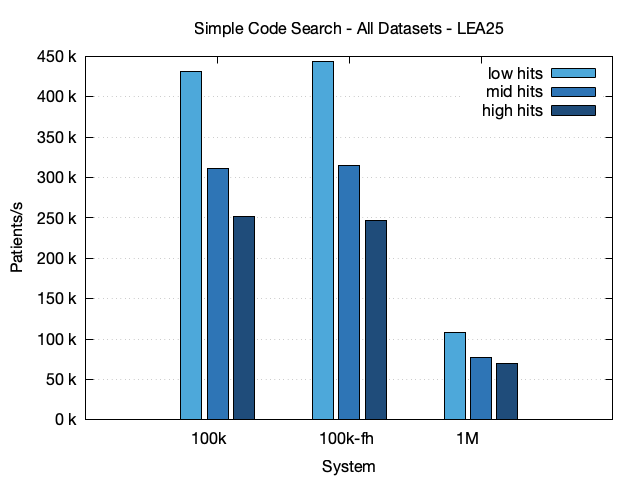

For the LEA25 system, the dataset with 1 million patients is to big, because the relative performance suffers compared to both the smaller datasets.

#### System - LEA36


With a bit lesser severity, the same can be said for the LEA36 system. It is to small for the 1M dataset.

#### System - LEA47

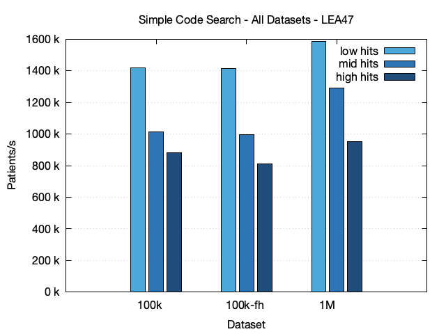

For the LEA47 system, the relative performance is the same for all datasets.

#### System - LEA58

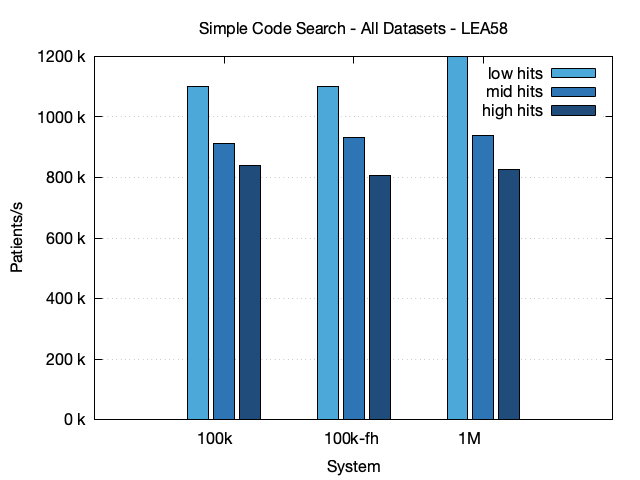

The same can be said for the LEA58 system.

### Data

| Dataset | System | Code    | # Hits | Time (s) | StdDev |  Pat./s |
|---------|--------|---------|-------:|---------:|-------:|--------:|
| 100k    | LEA25  | 17861-6 |    2 k |     0.23 |  0.004 | 430.8 k | 
| 100k    | LEA25  | 8310-5  |   60 k |     0.32 |  0.006 | 310.8 k | 
| 100k    | LEA25  | 72514-3 |  100 k |     0.40 |  0.008 | 251.7 k |
| 100k    | LEA36  | 17861-6 |    2 k |     0.15 |  0.005 | 648.5 k | 
| 100k    | LEA36  | 8310-5  |   60 k |     0.21 |  0.003 | 473.5 k | 
| 100k    | LEA36  | 72514-3 |  100 k |     0.24 |  0.003 | 412.6 k |
| 100k    | LEA47  | 17861-6 |    2 k |     0.11 |  0.004 | 887.4 k | 
| 100k    | LEA47  | 8310-5  |   60 k |     0.13 |  0.004 | 746.2 k | 
| 100k    | LEA47  | 72514-3 |  100 k |     0.15 |  0.004 | 647.7 k |
| 100k    | LEA58  | 17861-6 |    2 k |     0.09 |  0.002 |   1.1 M | 
| 100k    | LEA58  | 8310-5  |   60 k |     0.11 |  0.001 | 913.5 k | 
| 100k    | LEA58  | 72514-3 |  100 k |     0.12 |  0.003 | 839.7 k |
| 100k-fh | LEA25  | 788-0   |    2 k |     0.23 |  0.004 | 443.7 k |
| 100k-fh | LEA25  | 44261-6 |   57 k |     0.32 |  0.005 | 314.5 k |
| 100k-fh | LEA25  | 72514-3 |  100 k |     0.40 |  0.007 | 247.3 k |
| 100k-fh | LEA36  | 788-0   |    2 k |     0.15 |  0.003 | 657.0 k |
| 100k-fh | LEA36  | 44261-6 |   57 k |     0.22 |  0.008 | 459.1 k |
| 100k-fh | LEA36  | 72514-3 |  100 k |     0.24 |  0.012 | 410.1 k |
| 100k-fh | LEA47  | 788-0   |    2 k |     0.11 |  0.002 | 905.1 k |
| 100k-fh | LEA47  | 44261-6 |   57 k |     0.15 |  0.003 | 685.5 k |
| 100k-fh | LEA47  | 72514-3 |  100 k |     0.17 |  0.006 | 603.6 k |
| 100k-fh | LEA58  | 788-0   |    2 k |     0.09 |  0.002 |   1.1 M |
| 100k-fh | LEA58  | 44261-6 |   57 k |     0.11 |  0.002 | 931.4 k |
| 100k-fh | LEA58  | 72514-3 |  100 k |     0.12 |  0.003 | 806.5 k |
| 1M      | LEA25  | 17861-6 |   25 k |     9.22 |  0.050 | 108.4 k | 
| 1M      | LEA25  | 8310-5  |  603 k |    12.86 |  0.045 |  77.8 k | 
| 1M      | LEA25  | 72514-3 |  998 k |    14.35 |  0.040 |  69.7 k |
| 1M      | LEA36  | 17861-6 |   25 k |     3.90 |  0.134 | 256.7 k | 
| 1M      | LEA36  | 8310-5  |  603 k |     6.94 |  0.021 | 144.1 k | 
| 1M      | LEA36  | 72514-3 |  998 k |     8.08 |  0.065 | 123.8 k |
| 1M      | LEA47  | 17861-6 |   25 k |     1.06 |  0.007 | 940.1 k | 
| 1M      | LEA47  | 8310-5  |  603 k |     1.45 |  0.010 | 689.4 k | 
| 1M      | LEA47  | 72514-3 |  998 k |     1.71 |  0.006 | 586.1 k |
| 1M      | LEA58  | 17861-6 |   25 k |     0.85 |  0.006 |   1.2 M |
| 1M      | LEA58  | 8310-5  |  603 k |     1.07 |  0.007 | 938.9 k | 
| 1M      | LEA58  | 72514-3 |  998 k |     1.21 |  0.006 | 825.4 k |

### Example CQL Query

```text
library "observation-17861-6"
using FHIR version '4.0.0'
include FHIRHelpers version '4.0.0'

codesystem loinc: 'http://loinc.org'

context Patient

define InInitialPopulation:
  exists [Observation: Code '17861-6' from loinc]
```

The CQL queries can be executed with the following `blazectl` commands:

```sh
cql/search.sh observation-17861-6
cql/search.sh observation-8310-5
cql/search.sh observation-72514-3
cql/search.sh observation-788-0
cql/search.sh observation-44261-6
```

## Code and Value Search

In this section, CQL Queries for selecting patients which have observations with a certain code and value are analyzed. The values were chosen to produce a wide range of hits (number of matching patients). The hits are 10 k, 50 k and 100 k.


The first chart shows the results for the 100k dataset. It shows the number of patients a system can process per second as described above. The performance raises with the number of hits and system size. Especially the query matching all patients is nearly as fast as the simple code search because finding a match in the first observation is faster than having to go through multiple non-matching observations. This means, for code and value search finding lesser patients is costlier than finding more. 

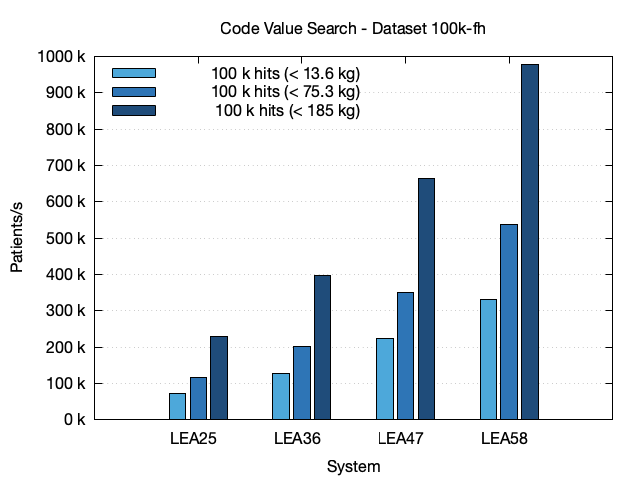

The second chart shows the results for the 100k-fh dataset. The queries used in the analysis against the 100k-fh dataset were the same as used for the other datasets. The number of hits however were always 100 k, because with full history also data from the patients childhood is included. Nevertheless, the performance using the same queries is nearly the same in the < 185 kg case and even better for the smaller values. 


The third chart shows the results for the 1M dataset. Here only the biggest system, the LEA58, can preserve the relative performance figures. All other systems suffer from memory restrictions.

### Charts Comparing the Datasets

#### System - LEA25

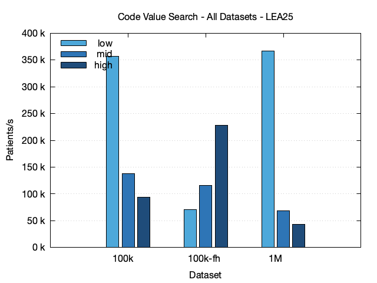

For the LEA25 system, the dataset with 1 million patients is to big, because the relative performance suffers compared to both the smaller datasets.

#### System - LEA36

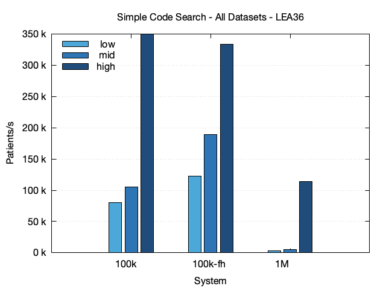

With a bit lesser severity, the same can be said for the LEA36 system. It is to small for the 1M dataset.

#### System - LEA47

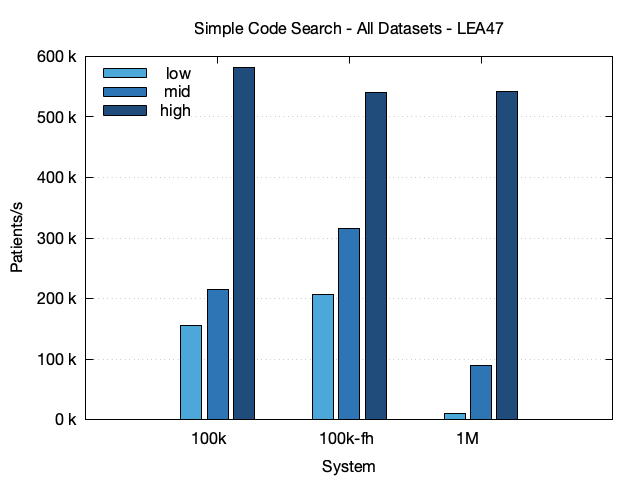

With a lesser severity, the same can be said for the LEA47 system. It is to small for the 1M dataset.

#### System - LEA58

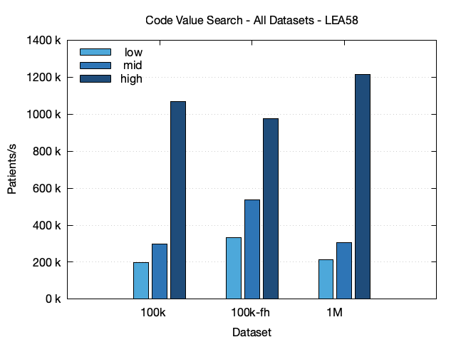

For the LEA58 system, the relative performance is the same for all datasets.

### Data

| Dataset | System | Code    |   Value | # Hits | Time (s) | StdDev |  Pat./s |
|---------|--------|---------|--------:|-------:|---------:|-------:|--------:|
| 100k    | LEA25  | 29463-7 | 13.6 kg |   10 k |     2.92 |  0.065 |  34.3 k | 
| 100k    | LEA25  | 29463-7 | 75.3 kg |   50 k |     1.56 |  0.022 |  64.1 k | 
| 100k    | LEA25  | 29463-7 |  185 kg |  100 k |     0.48 |  0.020 | 207.7 k |
| 100k    | LEA36  | 29463-7 | 13.6 kg |   10 k |     1.25 |  0.020 |  79.8 k | 
| 100k    | LEA36  | 29463-7 | 75.3 kg |   50 k |     0.95 |  0.026 | 105.7 k | 
| 100k    | LEA36  | 29463-7 |  185 kg |  100 k |     0.29 |  0.010 | 349.5 k |
| 100k    | LEA47  | 29463-7 | 13.6 kg |   10 k |     0.64 |  0.006 | 155.6 k | 
| 100k    | LEA47  | 29463-7 | 75.3 kg |   50 k |     0.46 |  0.006 | 215.3 k | 
| 100k    | LEA47  | 29463-7 |  185 kg |  100 k |     0.17 |  0.004 | 582.1 k |
| 100k    | LEA58  | 29463-7 | 13.6 kg |   10 k |     0.47 |  0.005 | 212.4 k |  
| 100k    | LEA58  | 29463-7 | 75.3 kg |   50 k |     0.35 |  0.005 | 282.9 k | 
| 100k    | LEA58  | 29463-7 |  185 kg |  100 k |     0.13 |  0.001 | 750.0 k |
| 100k-fh | LEA25  | 29463-7 | 13.6 kg |  100 k |     1.60 |  0.027 |  62.4 k |  
| 100k-fh | LEA25  | 29463-7 | 75.3 kg |  100 k |     0.89 |  0.015 | 112.8 k | 
| 100k-fh | LEA25  | 29463-7 |  185 kg |  100 k |     0.46 |  0.022 | 217.9 k |
| 100k-fh | LEA36  | 29463-7 | 13.6 kg |  100 k |     0.82 |  0.006 | 122.4 k |  
| 100k-fh | LEA36  | 29463-7 | 75.3 kg |  100 k |     0.53 |  0.003 | 189.4 k | 
| 100k-fh | LEA36  | 29463-7 |  185 kg |  100 k |     0.30 |  0.006 | 333.9 k |
| 100k-fh | LEA47  | 29463-7 | 13.6 kg |  100 k |     0.48 |  0.007 | 206.3 k |  
| 100k-fh | LEA47  | 29463-7 | 75.3 kg |  100 k |     0.32 |  0.002 | 315.3 k | 
| 100k-fh | LEA47  | 29463-7 |  185 kg |  100 k |     0.18 |  0.002 | 541.0 k |
| 100k-fh | LEA58  | 29463-7 | 13.6 kg |  100 k |     0.37 |  0.012 | 273.7 k |  
| 100k-fh | LEA58  | 29463-7 | 75.3 kg |  100 k |     0.22 |  0.011 | 446.1 k | 
| 100k-fh | LEA58  | 29463-7 |  185 kg |  100 k |     0.14 |  0.002 | 737.5 k |
| 1M      | LEA25  | 29463-7 | 13.6 kg |   99 k |   719.84 |  3.734 |   1.4 k | 
| 1M      | LEA25  | 29463-7 | 75.3 kg |  500 k |   479.52 | 11.096 |   2.1 k | 
| 1M      | LEA25  | 29463-7 |  185 kg |  998 k |   103.51 | 40.442 |   9.7 k |
| 1M      | LEA36  | 29463-7 | 13.6 kg |   99 k |   301.77 |  7.579 |   3.3 k | 
| 1M      | LEA36  | 29463-7 | 75.3 kg |  500 k |   177.09 |  3.228 |   5.6 k | 
| 1M      | LEA36  | 29463-7 |  185 kg |  998 k |     8.79 |  0.066 | 113.7 k |
| 1M      | LEA47  | 29463-7 | 13.6 kg |   99 k |   101.25 |  1.225 |   9.9 k | 
| 1M      | LEA47  | 29463-7 | 75.3 kg |  500 k |    11.05 |  0.647 |  90.5 k | 
| 1M      | LEA47  | 29463-7 |  185 kg |  998 k |     1.85 |  0.006 | 541.6 k |
| 1M      | LEA58  | 29463-7 | 13.6 kg |   99 k |     4.97 |  0.041 | 201.4 k |  
| 1M      | LEA58  | 29463-7 | 75.3 kg |  500 k |     3.14 |  0.009 | 318.5 k | 
| 1M      | LEA58  | 29463-7 |  185 kg |  998 k |     1.26 |  0.005 | 794.0 k |

### CQL Query

```text
library "observation-body-weight-50"
using FHIR version '4.0.0'
include FHIRHelpers version '4.0.0'

codesystem loinc: 'http://loinc.org'
code "body-weight": '29463-7' from loinc

context Patient

define InInitialPopulation:
  exists [Observation: "body-weight"] O where O.value < 75.3 'kg'
```

The CQL query is executed with the following `blazectl` command:

```sh
cql/search.sh observation-body-weight-10
cql/search.sh observation-body-weight-50
cql/search.sh observation-body-weight-100
```

## Ten Code Search

In this section, CQL queries for selecting patients which have conditions with one of 10 codes are analyzed. The codes were chosen to produce both a low number and a high number of hits. For the 100k dataset the hits are 395 and 95 k, for the 100k-fh dataset the hits are 2 k and 98 k and for the 1M dataset the hits are 4 k and 954 k.


The first chart shows the results for the 100k dataset. It shows that the performance raises with both the system size and the number of patients found. The performance increase for the query with large number of hits can be explained, because the or-expression does short-cut. That means that the evaluation will end at the first condition found. In the case with a low number of hits, nearly all 10 exists-expressions have to be evaluated, were in the high hit case, a lower amount of exists-expressions have to be evaluated.


The second chart shows the results for the 100k-fh dataset. For the 100k-fh dataset the performance is even better, because with the same codes chosen, the number of hits is higher. This means that having more history for each patient and therefore more conditions available, the same query will run faster.


The third chart shows the results for the 1M dataset. For the two bigger systems LEA47 and LEA58, the relative performance measured in patients per second is identical to the performance Blaze shows at the smaller datasets with only 100 k patients. However the same can't be said for the two smaller systems LEA25 and LEA36, were the relative performance suffers due to memory limitations of that systems.

### Charts Comparing the Datasets

#### System - LEA25

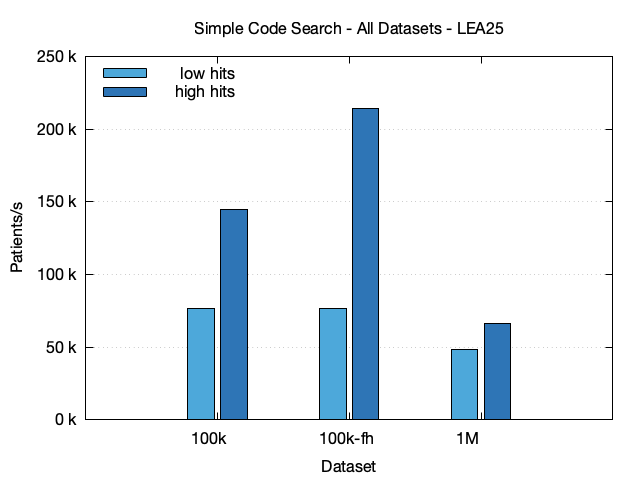

For the LEA25 system, the dataset with 1 million patients is to big, because the relative performance suffers compared to both the smaller datasets.

#### System - LEA36

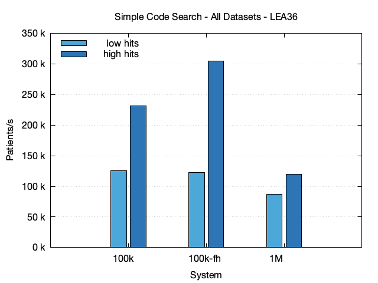

With a bit lesser severity, the same can be said for the LEA36 system. It is to small for the 1M dataset.

#### System - LEA47


For the LEA47 system, the relative performance is the same for both the 100k and 1M dataset and a bit higher for the 100k-fh dataset due to higher hit numbers.

#### System - LEA58

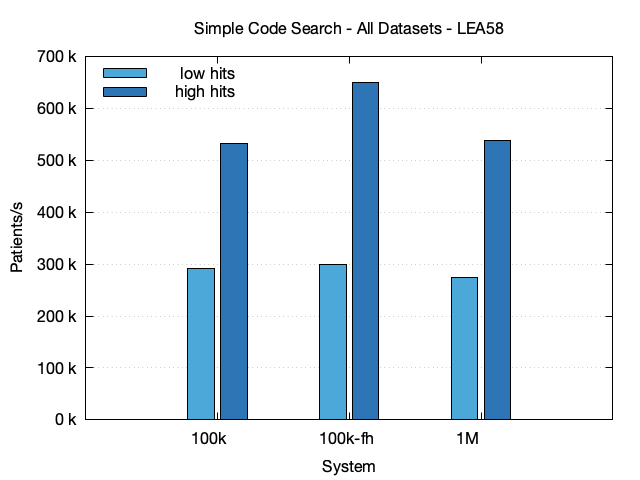

The same can be said for the LEA58 system.

### Data

| Dataset | System | # Hits | Time (s) | StdDev |  Pat./s |
|---------|--------|-------:|---------:|-------:|--------:|
| 100k    | LEA25  |    395 |     1.31 |  0.013 |  76.3 k |
| 100k    | LEA25  |   95 k |     0.69 |  0.016 | 144.9 k |
| 100k    | LEA36  |    395 |     0.80 |  0.020 | 125.6 k |
| 100k    | LEA36  |   95 k |     0.43 |  0.009 | 231.1 k |
| 100k    | LEA47  |    395 |     0.49 |  0.005 | 204.4 k |
| 100k    | LEA47  |   95 k |     0.26 |  0.008 | 384.2 k |
| 100k    | LEA58  |    395 |     0.34 |  0.004 | 291.0 k |
| 100k    | LEA58  |   95 k |     0.19 |  0.002 | 531.5 k |
| 100k-fh | LEA25  |    2 k |     1.32 |  0.009 |  75.9 k |
| 100k-fh | LEA25  |   98 k |     0.50 |  0.013 | 201.9 k |
| 100k-fh | LEA36  |    2 k |     0.82 |  0.019 | 122.4 k |
| 100k-fh | LEA36  |   98 k |     0.33 |  0.003 | 305.1 k |
| 100k-fh | LEA47  |    2 k |     0.49 |  0.011 | 202.0 k |
| 100k-fh | LEA47  |   98 k |     0.21 |  0.006 | 469.8 k |
| 100k-fh | LEA58  |    2 k |     0.33 |  0.004 | 299.9 k |
| 100k-fh | LEA58  |   98 k |     0.15 |  0.005 | 650.3 k |
| 1M      | LEA25  |    4 k |    20.74 |  0.134 |  48.2 k |
| 1M      | LEA25  |  954 k |    15.15 |  0.039 |  66.0 k |
| 1M      | LEA36  |    4 k |    11.52 |  0.054 |  86.8 k |
| 1M      | LEA36  |  954 k |     8.35 |  0.054 | 119.8 k |
| 1M      | LEA47  |    4 k |     4.99 |  0.026 | 200.5 k |
| 1M      | LEA47  |  954 k |     2.57 |  0.022 | 388.4 k |
| 1M      | LEA58  |    4 k |     3.64 |  0.038 | 274.4 k |
| 1M      | LEA58  |  954 k |     1.86 |  0.010 | 538.3 k |

### CQL Query Frequent

```text
library "condition-ten-frequent"
using FHIR version '4.0.0'
include FHIRHelpers version '4.0.0'

codesystem sct: 'http://snomed.info/sct'

context Patient

define InInitialPopulation:
  exists [Condition: Code '444814009' from sct] or
  exists [Condition: Code '840544004' from sct] or
  exists [Condition: Code '840539006' from sct] or
  exists [Condition: Code '386661006' from sct] or
  exists [Condition: Code '195662009' from sct] or
  exists [Condition: Code '49727002' from sct] or
  exists [Condition: Code '10509002' from sct] or
  exists [Condition: Code '72892002' from sct] or
  exists [Condition: Code '36955009' from sct] or
  exists [Condition: Code '162864005' from sct]
```

```sh
cql/search.sh condition-ten-frequent
```

### CQL Query Rare

```text
library "condition-ten-rare"
using FHIR version '4.0.0'
include FHIRHelpers version '4.0.0'

codesystem sct: 'http://snomed.info/sct'

context Patient

define InInitialPopulation:
  exists [Condition: Code '62718007' from sct] or
  exists [Condition: Code '234466008' from sct] or
  exists [Condition: Code '288959006' from sct] or
  exists [Condition: Code '47505003' from sct] or
  exists [Condition: Code '698754002' from sct] or
  exists [Condition: Code '157265008' from sct] or
  exists [Condition: Code '15802004' from sct] or
  exists [Condition: Code '14760008' from sct] or
  exists [Condition: Code '36923009' from sct] or
  exists [Condition: Code '45816000' from sct]
```

```sh
cql/search.sh condition-ten-rare
```
