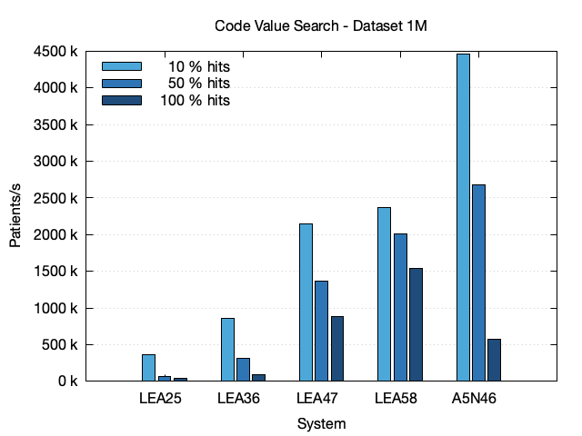
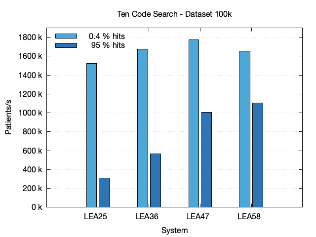
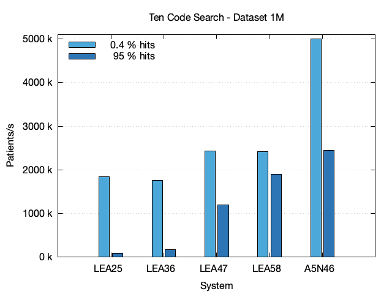
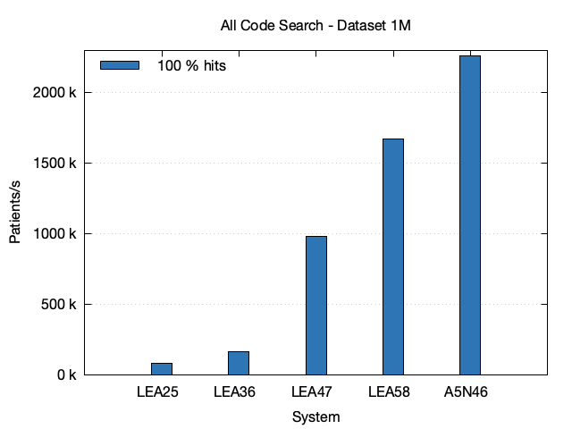
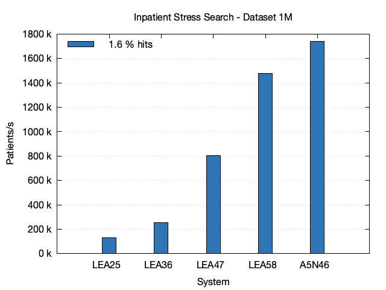
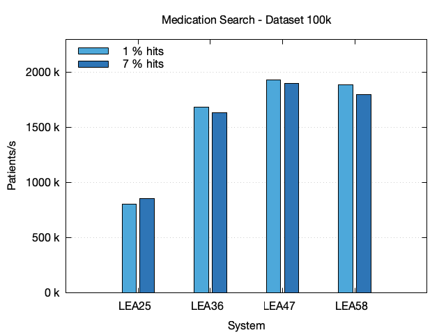

# CQL Performance

## TL;DR

For the CQL queries analyzed here, the relative performance of query evaluation in patients/s stays the same for datasets with 1 million patients compared to datasets with 100 thousand patients if the system resources are sufficient and Blaze performs equally or better for datasets with more patient history. In all cases the performance increases with rising system resources.  

## Systems

The following systems, with increasing resources, were used for the performance evaluation:

| System | Provider | CPU         | Cores |     RAM |  SSD |
|--------|----------|-------------|------:|--------:|-----:|
| LEA25  | on-prem  | EPYC 7543P  |     4 |  32 GiB | 2 TB | 
| LEA36  | on-prem  | EPYC 7543P  |     8 |  64 GiB | 2 TB | 
| LEA47  | on-prem  | EPYC 7543P  |    16 | 128 GiB | 2 TB | 
| LEA58  | on-prem  | EPYC 7543P  |    32 | 256 GiB | 2 TB | 
| A5N46  | on-prem  | Ryzen 9900X |    24 |  96 GiB | 2 TB | 

All systems were configured according the [Tuning Guide](../tuning-guide.md).

All systems have in common that the heap mem and the block cache both use 1/4 of the total available memory each. So the Blaze process itself will only use about half the system memory available. The rest of the system memory will be used as file system cache. 

## Datasets

The following datasets were used:

| Dataset | History  | # Pat. ¹ | # Res. ² | # Obs. ³ | Size on SSD |
|---------|----------|---------:|---------:|---------:|------------:|
| 100k    | 10 years |    100 k |    104 M |     59 M |     202 GiB |
| 100k-fh | full     |    100 k |    317 M |    191 M |     323 GiB |
| 1M      | 10 years |      1 M |   1044 M |    593 M |    1045 GiB |

¹ Number of Patients, ² Total Number of Resources, ³ Number of Observations

The creation of the datasets is described in the [Synthea section](./synthea/README.md). The disc size is measured after full manual compaction of the database. The actual disc size will be up to 50% higher, depending on the state of compaction which happens regularly in the background.

## Methods

### Metric

The metric analyzed here are the number of patients a system can process per second. It was chosen because the CQL evaluation performance depends heavily on the number of patients available in Blaze. The datasets contain either 100 k or 1 million patients in order to represent two relevant sizes from where an interpolation or extrapolation towards the target size should be possible. The metric patients per second itself is independent from the actual number of patients and can therefore be used to compare the two population sizes analysed here.

With a given patients per second value, its always possible to calculate the to be expected CQL evaluation duration by dividing the target systems number of patients by that number. So for example, if the metric is 100 k patients/s Blaze will need 1 second if it contains 100 k patients and 5 seconds if it contains 500 k patients.

### Measurement

Measurements are taken by using [blazectl][1]'s `evaluate-measure` subcommand. That subcommand first creates both a Measure and a Library resource and evaluates the Measure afterwards. By creating resources on every run, there is a slight performance impact due to the way LSM trees used by RocksDB work. The measure evaluation returns a MeasureReport that contains the evaluation duration in an extension which ensures that external timing effects play no role.

Before each measurement Blaze is restarted. After that multiple runs are taken. The first run is used to obtain the number of hits and print the Bloom filter usage. It's duration isn't used. After this run the script waits for 10 seconds in order to give Blaze time to settle. During this time the Java just-in-time compiler and garbage collector and to some work. After that 9 runs are done were the duration for the first two runs are discarded. From the remaining 7 durations, the average and standard deviation are calculated. From the average and the total number of patients the final metric patients per second is calculated.

### Systems

All measurements are taken on the same VM that has the size of LEA58. The OS is Ubuntu 22.04.4 LTS. Docker version is 26.1.4. 

## Simple Code Search

In this section, CQL queries for selecting patients which have observations with a certain code are analyzed. The codes were chosen to produce a wide range of hits (number of matching patients). For the 100k dataset the hits are 2 %, 60 % and 100 % of the total number of patients, for the 100k-fh dataset the hits are 2 %, 57 % and 100 % and for the 1M dataset the hits are 2.5 %, 60 % and 100 %.


The first chart shows the results for the 100k dataset. It shows that the performance raises with the system size and declines a lot with the number of patients found (hits). This decline can be explained because the Bloom filters are most effective for small number of hits.

 

The second bar chart shows the results for the 100k-fh dataset which differs by the 100 k dataset in that it contains a full history of patient data instead of a history capped at 10 years. Especially the number of observations is 191 M compared to only 59 M in the 100k dataset. Comparing the two bar charts, the performance is nearly identical. So for simple code search, the performance doesn't depend on the amount of patient history. 


The third bar chart shows the results for the 1M dataset. For the two bigger systems LEA47 and LEA58, the relative performance measured in patients per second is identical to the performance Blaze shows at the smaller datasets with only 100 k patients. However the same can't be said for the two smaller systems LEA25 and LEA36, were the relative performance suffers due to memory limitations of that systems. 

### Data

| Dataset | System | Code    | # Hits | Time (s) | StdDev |  Pat./s |
|---------|--------|---------|-------:|---------:|-------:|--------:|
| 100k    | LEA25  | 17861-6 |    2 k |     0.06 |  0.003 | 1.540 M | 
| 100k    | LEA25  | 8310-5  |   60 k |     0.25 |  0.014 | 402.3 k | 
| 100k    | LEA25  | 72514-3 |  100 k |     0.33 |  0.009 | 300.3 k |
| 100k    | LEA36  | 17861-6 |    2 k |     0.05 |  0.002 | 1.972 M | 
| 100k    | LEA36  | 8310-5  |   60 k |     0.12 |  0.005 | 819.7 k | 
| 100k    | LEA36  | 72514-3 |  100 k |     0.18 |  0.004 | 562.5 k |
| 100k    | LEA47  | 17861-6 |    2 k |     0.05 |  0.001 | 1.975 M | 
| 100k    | LEA47  | 8310-5  |   60 k |     0.07 |  0.002 | 1.363 M | 
| 100k    | LEA47  | 72514-3 |  100 k |     0.10 |  0.001 | 963.7 k |
| 100k    | LEA58  | 17861-6 |    2 k |     0.05 |  0.001 | 1.942 M | 
| 100k    | LEA58  | 8310-5  |   60 k |     0.07 |  0.001 | 1.351 M | 
| 100k    | LEA58  | 72514-3 |  100 k |     0.09 |  0.002 | 1.153 M |
| 100k-fh | LEA25  | 788-0   |    2 k |     0.07 |  0.003 | 1.513 M |
| 100k-fh | LEA25  | 44261-6 |   57 k |     0.24 |  0.007 | 425.2 k |
| 100k-fh | LEA25  | 72514-3 |  100 k |     0.35 |  0.007 | 282.3 k |
| 100k-fh | LEA36  | 788-0   |    2 k |     0.05 |  0.002 | 1.913 M |
| 100k-fh | LEA36  | 44261-6 |   57 k |     0.13 |  0.003 | 756.3 k |
| 100k-fh | LEA36  | 72514-3 |  100 k |     0.21 |  0.006 | 487.2 k |
| 100k-fh | LEA47  | 788-0   |    2 k |     0.05 |  0.002 | 1.981 M |
| 100k-fh | LEA47  | 44261-6 |   57 k |     0.07 |  0.001 | 1.370 M |
| 100k-fh | LEA47  | 72514-3 |  100 k |     0.10 |  0.001 | 970.7 k |
| 100k-fh | LEA58  | 788-0   |    2 k |     0.05 |  0.002 | 1.979 M |
| 100k-fh | LEA58  | 44261-6 |   57 k |     0.07 |  0.002 | 1.367 M |
| 100k-fh | LEA58  | 72514-3 |  100 k |     0.09 |  0.001 | 1.151 M |
| 1M      | LEA25  | 17861-6 |   25 k |     0.48 |  0.025 | 2.079 M | 
| 1M      | LEA25  | 8310-5  |  603 k |     9.33 |  0.033 | 107.1 k | 
| 1M      | LEA25  | 72514-3 |  998 k |    14.04 |  0.084 |  71.2 k |
| 1M      | LEA36  | 17861-6 |   25 k |     0.48 |  0.003 | 2.081 M | 
| 1M      | LEA36  | 8310-5  |  603 k |     4.74 |  0.038 | 211.1 k | 
| 1M      | LEA36  | 72514-3 |  998 k |     7.15 |  0.032 | 139.8 k |
| 1M      | LEA47  | 17861-6 |   25 k |     0.49 |  0.012 | 2.054 M | 
| 1M      | LEA47  | 8310-5  |  603 k |     0.67 |  0.010 | 1.488 M | 
| 1M      | LEA47  | 72514-3 |  998 k |     1.00 |  0.010 | 995.1 k |
| 1M      | LEA58  | 17861-6 |   25 k |     0.52 |  0.012 | 1.930 M |
| 1M      | LEA58  | 8310-5  |  603 k |     0.66 |  0.007 | 1.505 M | 
| 1M      | LEA58  | 72514-3 |  998 k |     0.78 |  0.019 | 1.287 M |
| 1M      | A5N46  | 17861-6 |   25 k |     0.22 |  0.008 | 4.514 M |
| 1M      | A5N46  | 8310-5  |  603 k |     0.39 |  0.001 | 2.545 M | 
| 1M      | A5N46  | 72514-3 |  998 k |     1.71 |  0.008 | 586.3 k |

### Example CQL Query

```text
library "observation-17861-6"
using FHIR version '4.0.0'
include FHIRHelpers version '4.0.0'

codesystem loinc: 'http://loinc.org'

context Patient

define InInitialPopulation:
  exists [Observation: Code '17861-6' from loinc]
```

The CQL queries can be executed with the following commands:

```sh
cql/search.sh observation-17861-6
cql/search.sh observation-8310-5
cql/search.sh observation-72514-3
cql/search.sh observation-788-0
cql/search.sh observation-44261-6
```

## Code and Value Search

In this section, CQL Queries for selecting patients which have observations with a certain code and value are analyzed. The values were chosen to produce a wide range of hits (number of matching patients). The hits are 10 %, 50 % and 100 %.


The first chart shows the results for the 100k dataset. It shows the number of patients a system can process per second as described above. The performance raises with system size. As with Simple Code Search, queries with a small number of hits are much faster as queries with a large number of hits due to Bloom filter optimizations. 



The second chart shows the results for the 1M dataset. Here the performance of the 10 % hits query is identical to that of the the 100k dataset. That can be explained because Bloom filter don't need much memory. However the two smaller systems LEA25 and LEA36 show a degradation in the performance of the queries with larger number of hits. Here the memory limitations show while going into the actual database storage layer. 

### Data

| Dataset | System | Code    |   Value | # Hits | Time (s) | StdDev |  Pat./s |
|---------|--------|---------|--------:|-------:|---------:|-------:|--------:|
| 100k    | LEA25  | 29463-7 | 13.6 kg |   10 k |     0.28 |  0.010 | 356.9 k | 
| 100k    | LEA25  | 29463-7 | 75.3 kg |   50 k |     0.73 |  0.017 | 137.7 k | 
| 100k    | LEA25  | 29463-7 |  185 kg |  100 k |     1.07 |  0.029 |  93.7 k |
| 100k    | LEA36  | 29463-7 | 13.6 kg |   10 k |     0.12 |  0.008 | 842.7 k | 
| 100k    | LEA36  | 29463-7 | 75.3 kg |   50 k |     0.33 |  0.011 | 306.0 k | 
| 100k    | LEA36  | 29463-7 |  185 kg |  100 k |     0.46 |  0.007 | 219.4 k |
| 100k    | LEA47  | 29463-7 | 13.6 kg |   10 k |     0.07 |  0.005 | 1.523 M | 
| 100k    | LEA47  | 29463-7 | 75.3 kg |   50 k |     0.15 |  0.004 | 676.3 k | 
| 100k    | LEA47  | 29463-7 |  185 kg |  100 k |     0.23 |  0.007 | 440.1 k |
| 100k    | LEA58  | 29463-7 | 13.6 kg |   10 k |     0.06 |  0.001 | 1.583 M |  
| 100k    | LEA58  | 29463-7 | 75.3 kg |   50 k |     0.12 |  0.005 | 869.4 k | 
| 100k    | LEA58  | 29463-7 |  185 kg |  100 k |     0.16 |  0.003 | 609.1 k |
| 1M      | LEA25  | 29463-7 | 13.6 kg |   99 k |     2.72 |  0.024 | 367.0 k | 
| 1M      | LEA25  | 29463-7 | 75.3 kg |  500 k |    14.65 |  0.187 |  68.2 k | 
| 1M      | LEA25  | 29463-7 |  185 kg |  998 k |    22.93 |  0.235 |  43.6 k |
| 1M      | LEA36  | 29463-7 | 13.6 kg |   99 k |     1.17 |  0.017 | 856.6 k | 
| 1M      | LEA36  | 29463-7 | 75.3 kg |  500 k |     3.19 |  0.052 | 313.6 k | 
| 1M      | LEA36  | 29463-7 |  185 kg |  998 k |    10.83 |  0.084 |  92.3 k |
| 1M      | LEA47  | 29463-7 | 13.6 kg |   99 k |     0.60 |  0.011 | 1.667 M | 
| 1M      | LEA47  | 29463-7 | 75.3 kg |  500 k |     1.63 |  0.023 | 612.6 k | 
| 1M      | LEA47  | 29463-7 |  185 kg |  998 k |     2.19 |  0.037 | 456.8 k |
| 1M      | LEA58  | 29463-7 | 13.6 kg |   99 k |     0.59 |  0.007 | 1.709 M |  
| 1M      | LEA58  | 29463-7 | 75.3 kg |  500 k |     1.01 |  0.013 | 993.3 k | 
| 1M      | LEA58  | 29463-7 |  185 kg |  998 k |     1.42 |  0.026 | 702.4 k |
| 1M      | A5N46  | 29463-7 | 13.6 kg |   99 k |     0.26 |  0.006 | 3.865 M | 
| 1M      | A5N46  | 29463-7 | 75.3 kg |  500 k |     0.47 |  0.032 | 2.114 M |
| 1M      | A5N46  | 29463-7 |  185 kg |  998 k |     1.78 |  0.047 | 560.7 k |

### CQL Query

```text
library "observation-body-weight-50"
using FHIR version '4.0.0'
include FHIRHelpers version '4.0.0'

codesystem loinc: 'http://loinc.org'
code "body-weight": '29463-7' from loinc

context Patient

define InInitialPopulation:
  exists [Observation: "body-weight"] O where O.value < 75.3 'kg'
```

The CQL query is executed with the following command:

```sh
cql/search.sh observation-body-weight-10
cql/search.sh observation-body-weight-50
cql/search.sh observation-body-weight-100
```

## Ten Code Search

In this section, CQL queries for selecting patients which have conditions with one of 10 codes are analyzed. The codes were chosen to produce both a low number and a high number of hits. For the 100k dataset the hits are 0.4 % and 95 %, for the 100k-fh dataset the hits are 2 % and 98 % and for the 1M dataset the hits are 0.4 % and 95 %.



The first chart shows the results for the 100k dataset. The performance raises with system size. As with Simple Code Search and Code Value Search, queries with a small number of hits are much faster as queries with a large number of hits due to Bloom filter optimizations.


The second chart shows the results for the 100k-fh dataset. For the 100k-fh dataset the performance of the query with small number of hits is lower because the number of hits if actually larger (2 %) as that of the 100k dataset with 0.4 %.



The third chart shows the results for the 1M dataset. As with the Code Value Search queries the performance for the query with low number of hits is the same across all system sizes, because Bloom filters don't need much memory. However the same can't be said for the query with 95 % hits. Here the LEA25 and LEA36 systems are clearly too small.

### Data

| Dataset | System | # Hits | Time (s) | StdDev |  Pat./s |
|---------|--------|-------:|---------:|-------:|--------:|
| 100k    | LEA25  |    395 |     0.07 |  0.004 | 1.524 M |
| 100k    | LEA25  |   95 k |     0.32 |  0.014 | 311.8 k |
| 100k    | LEA36  |    395 |     0.06 |  0.002 | 1.677 M |
| 100k    | LEA36  |   95 k |     0.18 |  0.005 | 568.2 k |
| 100k    | LEA47  |    395 |     0.06 |  0.001 | 1.772 M |
| 100k    | LEA47  |   95 k |     0.10 |  0.001 | 1.005 M |
| 100k    | LEA58  |    395 |     0.06 |  0.001 | 1.653 M |
| 100k    | LEA58  |   95 k |     0.09 |  0.001 | 1.105 M |
| 100k-fh | LEA25  |    2 k |     0.15 |  0.008 | 660.7 k |
| 100k-fh | LEA25  |   98 k |     0.39 |  0.019 | 259.2 k |
| 100k-fh | LEA36  |    2 k |     0.08 |  0.001 | 1.184 M |
| 100k-fh | LEA36  |   98 k |     0.18 |  0.004 | 553.7 k |
| 100k-fh | LEA47  |    2 k |     0.06 |  0.001 | 1.578 M |
| 100k-fh | LEA47  |   98 k |     0.11 |  0.002 | 949.3 k |
| 100k-fh | LEA58  |    2 k |     0.07 |  0.001 | 1.536 M |
| 100k-fh | LEA58  |   98 k |     0.09 |  0.002 | 1.084 M |
| 1M      | LEA25  |    4 k |     0.54 |  0.041 | 1.845 M |
| 1M      | LEA25  |  954 k |    10.93 |  0.068 |  91.5 k |
| 1M      | LEA36  |    4 k |     0.57 |  0.011 | 1.766 M |
| 1M      | LEA36  |  954 k |     5.65 |  0.033 | 177.1 k |
| 1M      | LEA47  |    4 k |     0.55 |  0.005 | 1.813 M |
| 1M      | LEA47  |  954 k |     0.97 |  0.016 | 1.029 M |
| 1M      | LEA58  |    4 k |     0.56 |  0.013 | 1.800 M |
| 1M      | LEA58  |  954 k |     0.84 |  0.007 | 1.191 M |
| 1M      | A5N46  |    4 k |     0.23 |  0.003 | 4.385 M |
| 1M      | A5N46  |  954 k |     0.53 |  0.003 | 1.875 M |

### CQL Query Frequent

```text
library "condition-ten-frequent"
using FHIR version '4.0.0'
include FHIRHelpers version '4.0.0'

codesystem sct: 'http://snomed.info/sct'

context Patient

define InInitialPopulation:
  exists [Condition: Code '444814009' from sct] or
  exists [Condition: Code '840544004' from sct] or
  exists [Condition: Code '840539006' from sct] or
  exists [Condition: Code '386661006' from sct] or
  exists [Condition: Code '195662009' from sct] or
  exists [Condition: Code '49727002' from sct] or
  exists [Condition: Code '10509002' from sct] or
  exists [Condition: Code '72892002' from sct] or
  exists [Condition: Code '36955009' from sct] or
  exists [Condition: Code '162864005' from sct]
```

```sh
cql/search.sh condition-ten-frequent
```

### CQL Query Rare

```text
library "condition-ten-rare"
using FHIR version '4.0.0'
include FHIRHelpers version '4.0.0'

codesystem sct: 'http://snomed.info/sct'

context Patient

define InInitialPopulation:
  exists [Condition: Code '62718007' from sct] or
  exists [Condition: Code '234466008' from sct] or
  exists [Condition: Code '288959006' from sct] or
  exists [Condition: Code '47505003' from sct] or
  exists [Condition: Code '698754002' from sct] or
  exists [Condition: Code '157265008' from sct] or
  exists [Condition: Code '15802004' from sct] or
  exists [Condition: Code '14760008' from sct] or
  exists [Condition: Code '36923009' from sct] or
  exists [Condition: Code '45816000' from sct]
```

```sh
cql/search.sh condition-ten-rare
```

## All Code Search



### Data

| Dataset | System | # Hits | Time (s) | StdDev |  Pat./s |
|---------|--------|-------:|---------:|-------:|--------:|
| 100k    | LEA25  |   99 k |     0.35 |  0.013 | 289.8 k |
| 100k    | LEA36  |   99 k |     0.19 |  0.003 | 517.7 k |
| 100k    | LEA47  |   99 k |     0.11 |  0.001 | 891.8 k |
| 100k    | LEA58  |   99 k |     0.10 |  0.001 | 1.050 M |
| 100k-fh | LEA25  |  100 k |     0.37 |  0.018 | 273.0 k |
| 100k-fh | LEA36  |  100 k |     0.20 |  0.006 | 506.3 k |
| 100k-fh | LEA47  |  100 k |     0.11 |  0.001 | 870.3 k |
| 100k-fh | LEA58  |  100 k |     0.10 |  0.001 | 1.038 M |
| 1M      | LEA25  |  995 k |    11.78 |  0.068 |  84.9 k |
| 1M      | LEA36  |  995 k |     5.96 |  0.015 | 167.7 k |
| 1M      | LEA47  |  995 k |     1.05 |  0.008 | 952.9 k |
| 1M      | LEA58  |  995 k |     0.86 |  0.006 | 1.164 M |
| 1M      | A5N46  |  995 k |     0.56 |  0.001 | 1.777 M |

### CQL Query

```sh
cql/search.sh condition-all
```

## Inpatient Stress Search



### Data

| Dataset | System | # Hits | Time (s) | StdDev |  Pat./s |
|---------|--------|-------:|---------:|-------:|--------:|
| 100k    | LEA25  |    2 k |     0.59 |  0.017 | 169.1 k |
| 100k    | LEA36  |    2 k |     0.31 |  0.009 | 326.7 k |
| 100k    | LEA47  |    2 k |     0.17 |  0.004 | 580.5 k |
| 100k    | LEA58  |    2 k |     0.15 |  0.005 | 683.1 k |
| 100k-fh | LEA25  |    2 k |     1.89 |  0.016 |  52.8 k |
| 100k-fh | LEA36  |    2 k |     1.15 |  0.014 |  86.9 k |
| 100k-fh | LEA47  |    2 k |     0.78 |  0.004 | 127.9 k |
| 100k-fh | LEA58  |    2 k |     0.54 |  0.006 | 184.4 k |
| 1M      | LEA25  |   16 k |     7.69 |  0.108 | 130.0 k |
| 1M      | LEA36  |   16 k |     3.90 |  0.041 | 256.7 k |
| 1M      | LEA47  |   16 k |     1.88 |  0.025 | 531.2 k |
| 1M      | LEA58  |   16 k |     1.21 |  0.014 | 823.8 k |
| 1M      | A5N46  |   16 k |     0.74 |  0.047 | 1.347 M |

### CQL Query

```sh
cql/search.sh inpatient-stress
```

## Medication




| Dataset | System | # Hits | Time (s) | StdDev |  Pat./s |
|---------|--------|-------:|---------:|-------:|--------:|
| 100k    | LEA25  |    966 |     0.12 |  0.004 | 806.4 k |
| 100k    | LEA25  |    7 k |     0.12 |  0.006 | 854.3 k |
| 100k    | LEA36  |    966 |     0.06 |  0.003 | 1.684 M |
| 100k    | LEA36  |    7 k |     0.06 |  0.002 | 1.637 M |
| 100k    | LEA47  |    966 |     0.05 |  0.000 | 1.930 M |
| 100k    | LEA47  |    7 k |     0.05 |  0.001 | 1.900 M |
| 100k    | LEA58  |    966 |     0.05 |  0.001 | 1.889 M |
| 100k    | LEA58  |    7 k |     0.06 |  0.001 | 1.800 M |
| 1M      | LEA25  |   10 k |     1.39 |  0.005 | 720.1 k |
| 1M      | LEA25  |   66 k |     1.31 |  0.011 | 765.3 k |
| 1M      | LEA36  |   10 k |     0.69 |  0.003 | 1.440 M |
| 1M      | LEA36  |   66 k |     0.68 |  0.007 | 1.478 M |
| 1M      | LEA47  |   10 k |     0.47 |  0.002 | 2.145 M |
| 1M      | LEA47  |   66 k |     0.45 |  0.004 | 2.214 M |
| 1M      | LEA58  |   10 k |     0.48 |  0.003 | 2.085 M |
| 1M      | LEA58  |   66 k |     0.47 |  0.003 | 2.140 M |

### CQL Queries

```sh
cql/search.sh medication-1
cql/search.sh medication-7
```

## Medication Ten


| Dataset | System | # Hits | Time (s) | StdDev |  Pat./s |
|---------|--------|-------:|---------:|-------:|--------:|
| 100k    | LEA25  |   15 k |     0.19 |  0.009 | 533.7 k |
| 100k    | LEA36  |   15 k |     0.10 |  0.002 | 1.022 M |
| 100k    | LEA47  |   15 k |     0.07 |  0.002 | 1.486 M |
| 100k    | LEA58  |   15 k |     0.07 |  0.001 | 1.491 M |
| 1M      | LEA25  |  149 k |     2.83 |  0.026 | 353.4 k |
| 1M      | LEA36  |  149 k |     1.39 |  0.004 | 719.4 k |
| 1M      | LEA47  |  149 k |     0.72 |  0.006 | 1.393 M |
| 1M      | LEA58  |  149 k |     0.64 |  0.003 | 1.574 M |


## Condition Code Stratification

### Data

| Dataset | System | # Hits | Time (s) | StdDev | Pat./s |
|---------|--------|-------:|---------:|-------:|-------:|
| 100k    | LEA58  |  5.2 M |    12.79 |  0.325 |  7.8 k |
| 1M      | LEA58  | 52.3 M |   399.64 | 11.966 |  2.5 k |
| 1M      | A5N46  | 52.3 M |   372.40 |  1.350 |  2.7 k |

### CQL Queries

```sh
cql/search.sh stratifier-condition-code
```

## Laboratory Observation Code Stratification

### Data

| Dataset | System |  # Hits | Time (s) | StdDev | Pat./s |
|---------|--------|--------:|---------:|-------:|-------:|
| 100k    | LEA58  |  37.8 M |   280.40 |  3.026 |      0 |
| 1M      | A5N46  | 380.5 M |  2768.19 |  9.310 |      0 |

### CQL Queries

```sh
cql/search.sh stratifier-observation-laboratory-code
```

[1]: <https://github.com/samply/blazectl>
