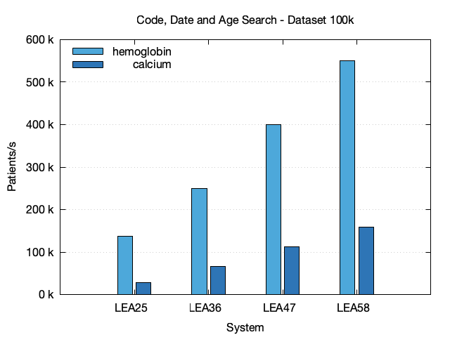

## Code, Date and Age Search

In this section, CQL Queries for selecting patients which have observation resources with code 718-7 (Hemoglobin), date between 2015 and 2019 and age of patient at observation date below 18.



### Data

| Dataset | System | Code       | # Hits | Time (s) | StdDev |  Pat./s |
|---------|--------|------------|-------:|---------:|-------:|--------:|
| 100k    | LEA25  | hemoglobin |   20 k |     0.73 |  0.019 | 136.8 k |
| 100k    | LEA25  | calcium    |   20 k |     3.57 |  0.094 |  28.0 k |
| 100k    | LEA36  | hemoglobin |   20 k |     0.40 |  0.008 | 250.4 k |
| 100k    | LEA36  | calcium    |   20 k |     1.49 |  0.012 |  67.1 k |
| 100k    | LEA47  | hemoglobin |   20 k |     0.25 |  0.004 | 399.4 k |
| 100k    | LEA47  | calcium    |   20 k |     0.89 |  0.019 | 112.3 k |
| 100k    | LEA58  | hemoglobin |   20 k |     0.18 |  0.002 | 549.6 k |
| 100k    | LEA58  | calcium    |   20 k |     0.63 |  0.010 | 159.2 k |
| 100k-fh | LEA58  | hemoglobin |   20 k |     0.49 |  0.003 | 204.1 k |
| 100k-fh | LEA58  | calcium    |   20 k |     1.55 |  0.015 |  64.6 k |
| 1M      | LEA47  | hemoglobin |  200 k |     2.99 |  0.026 | 334.6 k |
| 1M      | LEA47  | calcium    |  199 k |   120.68 |  1.678 |   8.3 k |
| 1M      | LEA58  | hemoglobin |  200 k |     1.74 |  0.002 | 574.5 k |
| 1M      | LEA58  | calcium    |  199 k |     6.37 |  0.030 | 156.9 k |

### CQL Query

```text
library "hemoglobin-date-age"
using FHIR version '4.0.0'
include FHIRHelpers version '4.0.0'

codesystem loinc: 'http://loinc.org'

context Patient

define InInitialPopulation:
  exists [Observation: Code '718-7' from loinc] O
  where year from (O.effective as dateTime) between 2015 and 2019
  and AgeInYearsAt(O.effective as dateTime) < 18
```

The CQL query is executed with the following `blazectl` command:

```sh
cql/search.sh hemoglobin-date-age
cql/search.sh calcium-date-age
```
