# FHIR Search Performance

## TL;DR

Under ideal conditions, Blaze can execute a FHIR Search query for a single code at a rate of **6 million resources per second** and export the matching resources at **150,000 resources per second**. This performance is independent of the total number of resources held in the database.

## Systems

The following systems, with increasing resources, were used for the performance evaluation:

| System | Provider | CPU         | Cores |     RAM |  SSD |
|--------|----------|-------------|------:|--------:|-----:|
| LEA25  | on-prem  | EPYC 7543P  |     4 |  32 GiB | 2 TB |
| LEA36  | on-prem  | EPYC 7543P  |     8 |  64 GiB | 2 TB |
| LEA47  | on-prem  | EPYC 7543P  |    16 | 128 GiB | 2 TB |
| LEA58  | on-prem  | EPYC 7543P  |    32 | 256 GiB | 2 TB |
| LEA79  | on-prem  | EPYC 9555   |   128 | 768 GiB | 2 TB |
| A5N46  | on-prem  | Ryzen 9900X |    24 |  96 GiB | 2 TB |

All systems were configured according to the [Production Configuration](../production-configuration.md) Guide.

On all systems, the heap memory and the block cache were each configured to use 1/4 of the total available RAM. Consequently, the Blaze process itself uses about half of the available system memory, leaving the remainder for the file system cache.

## Datasets

The following datasets were used:

| Dataset | History  | # Pat. ¹ | # Res. ² | # Obs. ³ | Size on SSD |
|---------|----------|---------:|---------:|---------:|------------:|
| 100k    | 10 years |    100 k |    104 M |     59 M |     110 GiB |
| 1M      | 10 years |      1 M |   1044 M |    593 M |    1045 GiB |

¹ Number of Patients, ² Total Number of Resources, ³ Number of Observations

The creation of these datasets is described in the [Synthea section](./synthea/README.md). The disk size was measured after a full manual compaction of the database. The actual disk size can be up to 50% higher, depending on the state of the background compaction process.

## Simple Code Search

This section evaluates the performance of FHIR Search for selecting Observation resources with a specific code.

### Script

The script `simple-code-search.sh` is used.

### Counting

| System | Dataset | Code    | # Hits | Time (s) | StdDev | Res/s ¹ |
|--------|---------|---------|-------:|---------:|-------:|--------:|
| LEA36  | 100k    | 8310-5  |  115 k |     0.06 |  0.003 |  1.92 M |
| LEA36  | 100k    | 55758-7 |  1.0 M |     0.49 |  0.005 |  2.04 M |
| LEA36  | 100k    | 72514-3 |  2.7 M |     1.28 |  0.022 |  2.11 M |
| LEA47  | 100k    | 8310-5  |  115 k |     0.06 |  0.001 |  1.92 M |
| LEA47  | 100k    | 55758-7 |  1.0 M |     0.50 |  0.010 |  2.00 M |
| LEA47  | 100k    | 72514-3 |  2.7 M |     1.34 |  0.026 |  2.01 M |
| LEA58  | 100k    | 8310-5  |  115 k |     0.07 |  0.002 |  1.64 M |
| LEA58  | 100k    | 55758-7 |  1.0 M |     0.54 |  0.020 |  1.85 M |
| LEA58  | 100k    | 72514-3 |  2.7 M |     1.43 |  0.045 |  1.89 M |
| LEA47  | 1M      | 8310-5  |  1.1 M |     0.42 |  0.010 |   2.8 M |
| LEA47  | 1M      | 55758-7 | 10.1 M |     3.85 |  0.068 |   2.6 M |
| LEA47  | 1M      | 72514-3 | 27.3 M |     8.96 |  0.098 |   3.0 M |
| LEA58  | 1M      | 8310-5  |  1.1 M |     0.39 |  0.009 |   3.0 M |
| LEA58  | 1M      | 55758-7 | 10.1 M |     2.84 |  0.026 |   3.6 M |
| LEA58  | 1M      | 72514-3 | 27.3 M |     7.52 |  0.138 |   3.6 M |
| LEA79  | 1M      | 8310-5  |  1.1 M |     0.22 |  0.025 |   5.2 M |
| LEA79  | 1M      | 55758-7 | 10.1 M |     1.51 |  0.036 |   6.7 M |
| LEA79  | 1M      | 72514-3 | 27.3 M |     3.90 |  0.026 |   7.0 M |
| A5N46  | 1M      | 8310-5  |  1.1 M |     0.19 |  0.017 |   6.0 M |
| A5N46  | 1M      | 55758-7 | 10.1 M |     2.12 |  0.025 |   4.8 M |
| A5N46  | 1M      | 72514-3 | 27.3 M |     4.00 |  0.030 |   6.8 M |

¹ resources per second

### Downloading Resources

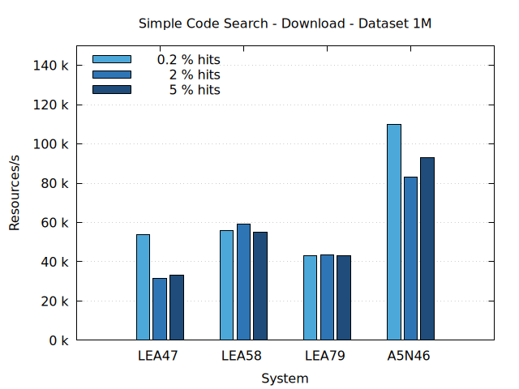

| System | Dataset | Code    | # Hits | Time (s) | StdDev | Res/s ¹ |
|--------|---------|---------|-------:|---------:|-------:|--------:|
| LEA36  | 100k    | 8310-5  |  115 k |     1.90 |  0.016 | 60.53 k |  
| LEA36  | 100k    | 55758-7 |  1.0 M |    15.45 |  0.121 | 64.72 k |
| LEA36  | 100k    | 72514-3 |  2.7 M |    41.09 |  0.530 | 65.71 k |
| LEA47  | 100k    | 8310-5  |  115 k |     2.00 |  0.021 | 57.50 k |  
| LEA47  | 100k    | 55758-7 |  1.0 M |    15.99 |  0.147 | 62.54 k |
| LEA47  | 100k    | 72514-3 |  2.7 M |    43.48 |  0.128 | 62.10 k |
| LEA58  | 100k    | 8310-5  |  115 k |     1.96 |  0.039 | 58.67 k |  
| LEA58  | 100k    | 55758-7 |  1.0 M |    16.61 |  0.161 | 60.20 k |
| LEA58  | 100k    | 72514-3 |  2.7 M |    43.84 |  0.124 | 61.59 k |         
| LEA47  | 1M      | 8310-5  |  1.1 M |    19.08 |  0.095 |  60.7 k |         
| LEA47  | 1M      | 55758-7 | 10.1 M |   296.37 | 46.454 |  34.2 k |         
| LEA47  | 1M      | 72514-3 | 27.3 M |   658.56 |  6.587 |  41.5 k |
| LEA58  | 1M      | 8310-5  |  1.1 M |    20.70 |  0.320 |  56.0 k |         
| LEA58  | 1M      | 55758-7 | 10.1 M |   171.60 |  4.241 |  59.1 k |         
| LEA58  | 1M      | 72514-3 | 27.3 M |   497.29 | 26.969 |  55.0 k |
| LEA79  | 1M      | 8310-5  |  1.1 M |    23.59 |  0.128 |  49.1 k |         
| LEA79  | 1M      | 55758-7 | 10.1 M |   183.43 |  0.323 |  55.3 k |         
| LEA79  | 1M      | 72514-3 | 27.3 M |   474.16 |  1.313 |  57.7 k |
| A5N46  | 1M      | 8310-5  |  1.1 M |     9.32 |  0.057 | 124.4 k |         
| A5N46  | 1M      | 55758-7 | 10.1 M |    89.66 |  0.203 | 113.1 k |        
| A5N46  | 1M      | 72514-3 | 27.3 M |   197.36 |  0.384 | 138.5 k |

¹ resources per second

### Downloading Resources with Subsetting

If only a subset of a resource's information is needed, the `_elements` search parameter can be used to retrieve only specific properties. In this case, `_elements=subject` was used.

| System | Dataset | Code    | # Hits | Time (s) | StdDev |  Res/s ¹ |
|--------|---------|---------|-------:|---------:|-------:|---------:|
| LEA36  | 100k    | 8310-5  |  115 k |     1.26 |  0.009 |  91.27 k |
| LEA36  | 100k    | 55758-7 |  1.0 M |     9.70 |  0.070 | 103.09 k |
| LEA36  | 100k    | 72514-3 |  2.7 M |    25.82 |  0.440 | 104.57 k |
| LEA47  | 100k    | 8310-5  |  115 k |     1.34 |  0.009 |  85.82 k |
| LEA47  | 100k    | 55758-7 |  1.0 M |     9.95 |  0.065 | 100.50 k |
| LEA47  | 100k    | 72514-3 |  2.7 M |    26.76 |  0.284 | 100.90 k |
| LEA58  | 100k    | 8310-5  |  115 k |     1.28 |  0.017 |  89.84 k |
| LEA58  | 100k    | 55758-7 |  1.0 M |    10.55 |  0.209 |  94.79 k |
| LEA58  | 100k    | 72514-3 |  2.7 M |    27.15 |  0.749 |  99.45 k |
| LEA47  | 1M      | 8310-5  |  1.1 M |    13.67 |  0.204 |   84.8 k |          
| LEA47  | 1M      | 55758-7 | 10.1 M |   338.50 |  7.638 |   30.0 k |          
| LEA47  | 1M      | 72514-3 | 27.3 M |   546.44 |  7.829 |   50.0 k |
| LEA58  | 1M      | 8310-5  |  1.1 M |    15.42 |  0.208 |   75.1 k |          
| LEA58  | 1M      | 55758-7 | 10.1 M |   124.03 |  1.024 |   81.8 k |          
| LEA58  | 1M      | 72514-3 | 27.3 M |   343.16 |  1.412 |   79.7 k |
| LEA79  | 1M      | 8310-5  |  1.1 M |    16.58 |  0.052 |   69.9 k |          
| LEA79  | 1M      | 55758-7 | 10.1 M |   130.13 |  0.167 |   77.9 k |          
| LEA79  | 1M      | 72514-3 | 27.3 M |   322.49 |  0.359 |   84.8 k |
| A5N46  | 1M      | 8310-5  |  1.1 M |     6.83 |  0.041 |  169.8 k |          
| A5N46  | 1M      | 55758-7 | 10.1 M |    63.97 |  0.034 |  158.5 k |          
| A5N46  | 1M      | 72514-3 | 27.3 M |   143.01 |  0.139 |  191.2 k |          

¹ resources per second

## Multiple Codes Search

This section evaluates the performance of FHIR Search for selecting Observation resources with multiple codes.

The following codes were used:

* 10 LOINC codes from `observation-codes-10.txt`
* 100 LOINC codes from `observation-codes-100.txt`

### Script

The script `multiple-codes-search.sh` is used.

### Counting

| System | Dataset | Codes | # Hits | Time (s) | StdDev | Res/s ¹ |
|--------|---------|-------|-------:|---------:|-------:|--------:|
| LEA47  | 1M      | 10    | 29.1 M |    12.69 |  0.147 |   2.3 M |
| LEA47  | 1M      | 100   | 36.3 M |    19.32 |  0.067 |   1.9 M |
| LEA79  | 1M      | 10    | 29.1 M |     5.97 |  0.030 |   4.9 M |
| LEA79  | 1M      | 100   | 36.3 M |     9.53 |  0.193 |   3.8 M |
| A5N46  | 1M      | 10    | 29.1 M |     6.41 |  0.034 |   4.5 M |
| A5N46  | 1M      | 100   | 36.3 M |     9.15 |  0.057 |   4.0 M |

¹ resources per second

### Downloading Resources

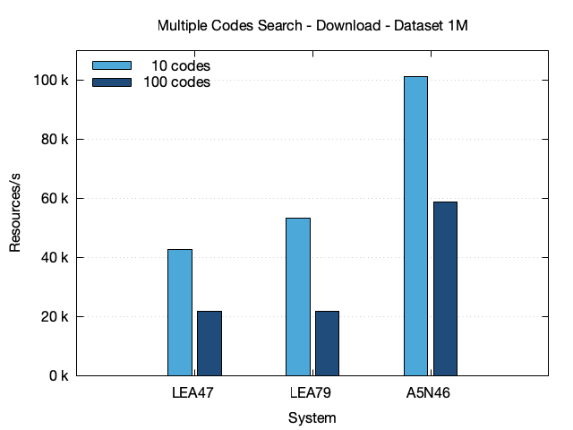

| System | Dataset | Codes | # Hits | Time (s) | StdDev | Res/s ¹ |
|--------|---------|-------|-------:|---------:|-------:|--------:|
| LEA47  | 1M      | 10    | 29.1 M |   680.86 |  9.238 |  42.7 k |
| LEA47  | 1M      | 100   | 36.3 M |  1663.36 |  1.855 |  21.8 k |
| LEA79  | 1M      | 10    | 29.1 M |   544.05 |  4.034 |  53.4 k |
| LEA79  | 1M      | 100   | 36.3 M |  1663.36 |  1.855 |  21.8 k |
| A5N46  | 1M      | 10    | 29.1 M |   287.30 |  0.301 | 101.2 k |
| A5N46  | 1M      | 100   | 36.3 M |   619.24 |  0.481 |  58.7 k |

¹ resources per second

## Multiple Codes Search – ValueSet

This section evaluates the performance of FHIR Search for selecting Observation resources with multiple codes using the in-modifier with a VCL value set URL.

The following codes were used:

* 10 LOINC codes from `observation-codes-10.txt`
* 100 LOINC codes from `observation-codes-100.txt`

### Script

The script `multiple-codes-search-vs.sh` is used.

### Counting

| System | Dataset | Codes | # Hits | Time (s) | StdDev | Res/s ¹ |
|--------|---------|-------|-------:|---------:|-------:|--------:|
| A5N46  | 1M      | 10    | 29.1 M |     6.40 |  0.056 |   4.5 M |
| A5N46  | 1M      | 100   | 36.3 M |     9.55 |  0.015 |   3.8 M |

¹ resources per second

### Downloading Resources

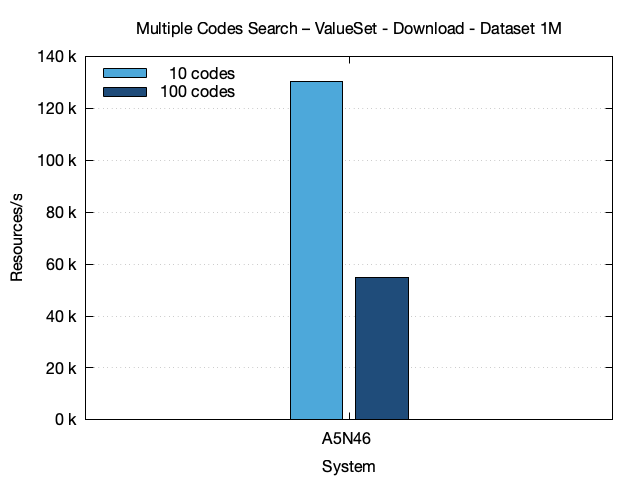

| System | Dataset | Codes | # Hits | Time (s) | StdDev | Res/s ¹ |
|--------|---------|-------|-------:|---------:|-------:|--------:|
| A5N46  | 1M      | 10    | 29.1 M |   222.90 |  0.282 | 130.4 k |
| A5N46  | 1M      | 100   | 36.3 M |   662.26 |  0.759 |  54.8 k |

¹ resources per second

## Multiple Search Parameter Search

This section evaluates the performance of FHIR search queries with multiple search parameters and multiple codes.

Two sets of codes were used:

| Category    | Name  | Codes                                     |
|-------------|-------|-------------------------------------------|
| laboratory  | top-5 | 49765-1, 20565-8, 2069-3, 38483-4, 2339-0 |
| vital-signs | low-5 | 2713-6, 8478-0, 8310-5, 77606-2, 9843-4   |

### Script

The script `observation-final-category-multiple-codes-search.sh` is used.

### Counting

| System | Dataset | Category    | Codes | # Hits | Time (s) | StdDev | Res/s ¹ |
|--------|---------|-------------|------:|-------:|---------:|-------:|--------:|
| LEA47  | 1M      | laboratory  | top-5 | 90.3 M |   398.47 |  1.039 | 226.5 k |
| LEA47  | 1M      | vital-signs | low-5 |  3.5 M |     5.45 |  0.436 | 646.7 k |
| LEA58  | 1M      | laboratory  | top-5 | 90.3 M |   352.50 |  8.995 | 256.1 k |
| LEA58  | 1M      | vital-signs | low-5 |  3.5 M |     1.43 |  0.018 |   2.5 M |
| LEA79  | 1M      | laboratory  | top-5 | 90.3 M |   188.37 |  1.120 | 479.2 k |
| LEA79  | 1M      | vital-signs | low-5 |  3.5 M |     0.78 |  0.017 |   4.5 M |
| A5N46  | 1M      | laboratory  | top-5 | 90.3 M |   171.18 |  2.281 | 527.3 k |
| A5N46  | 1M      | vital-signs | low-5 |  3.5 M |     2.65 |  0.004 |   1.3 M |

¹ resources per second

### Downloading Resources

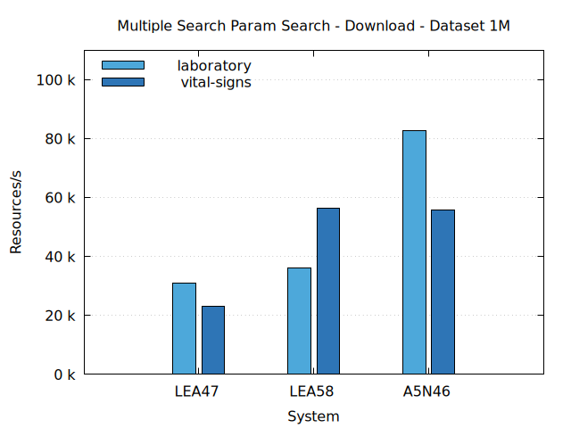

| System | Dataset | Category    | Codes | # Hits | Time (s) |  StdDev | Res/s ¹ |
|--------|---------|-------------|------:|-------:|---------:|--------:|--------:|
| LEA47  | 1M      | laboratory  | top-5 | 90.3 M |  2923.45 |   7.951 |  30.9 k |
| LEA47  | 1M      | vital-signs | low-5 |  3.5 M |   153.07 |  29.422 |  23.0 k |
| LEA58  | 1M      | laboratory  | top-5 | 90.3 M |  2490.08 | 101.868 |  36.2 k |
| LEA58  | 1M      | vital-signs | low-5 |  3.5 M |    62.43 |   0.356 |  56.5 k |
| LEA79  | 1M      | laboratory  | top-5 | 90.3 M |  2131.41 |   4.699 |  42.3 k |
| LEA79  | 1M      | vital-signs | low-5 |  3.5 M |    93.21 |   0.379 |  37.8 k |
| A5N46  | 1M      | laboratory  | top-5 | 90.3 M |   879.94 |   5.539 | 102.6 k |
| A5N46  | 1M      | vital-signs | low-5 |  3.5 M |    56.19 |   0.472 |  62.7 k |

¹ resources per second

### Downloading Resources with Subsetting

If only a subset of a resource's information is needed, the `_elements` search parameter can be used to retrieve only specific properties. In this case, `_elements=subject` was used.

| System | Dataset | Category    | Codes | # Hits | Time (s) |  StdDev | Res/s ¹ |
|--------|---------|-------------|------:|-------:|---------:|--------:|--------:|
| LEA47  | 1M      | laboratory  | top-5 | 90.3 M |  2625.21 |  24.973 |  34.4 k |
| LEA47  | 1M      | vital-signs | low-5 |  3.5 M |   118.72 |   0.099 |  29.7 k |
| LEA58  | 1M      | laboratory  | top-5 | 90.3 M |  2200.60 | 232.968 |  41.0 k |
| LEA58  | 1M      | vital-signs | low-5 |  3.5 M |    54.94 |   5.827 |  64.2 k |
| LEA79  | 1M      | laboratory  | top-5 | 90.3 M |  1814.34 | 276.746 |  49.8 k |
| LEA79  | 1M      | vital-signs | low-5 |  3.5 M |    83.11 |   8.750 |  42.4 k |
| A5N46  | 1M      | laboratory  | top-5 | 90.3 M |   776.93 |  89.288 | 116.2 k |
| A5N46  | 1M      | vital-signs | low-5 |  3.5 M |    51.85 |   3.770 |  68.0 k |

¹ resources per second

## Forward Chaining Search

This section evaluates the performance of FHIR search queries with one forward chaining search parameter.

### Script

The script `forward-chaining-search.sh` is used.

### Counting

| System | Dataset | # Hits | Time (s) | StdDev | Res/s ¹ |
|--------|---------|-------:|---------:|-------:|--------:|
| LEA47  | 1M      |   13 k |     0.81 |  0.004 |  16.0 k |

¹ resources per second

### Downloading Resources

| System | Dataset | # Hits | Time (s) | StdDev | Res/s ¹ |
|--------|---------|-------:|---------:|-------:|--------:|
| LEA47  | 1M      |   13 k |     8.15 |  0.029 |   1.6 k |

¹ resources per second

## Token and Forward Chaining Search

This section evaluates the performance of FHIR search queries with one badly discriminating token search parameter and one well discriminating forward chaining search parameter.

### Script

The script `token-forward-chaining-search.sh` is used.

### Counting

| System | Dataset | # Hits | Time (s) | StdDev | Res/s ¹ |
|--------|---------|-------:|---------:|-------:|--------:|
| LEA47  | 1M      |   32 k |     0.30 |  0.010 | 105.2 k |
| LEA79  | 1M      |   32 k |     0.16 |  0.014 | 192.6 k |
| A5N46  | 1M      |   32 k |     0.12 |  0.004 | 272.0 k |

¹ resources per second

### Downloading Resources

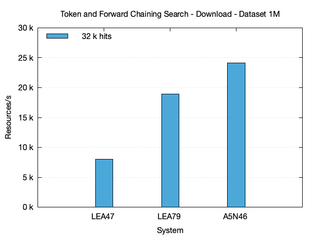

| System | Dataset | # Hits | Time (s) | StdDev | Res/s ¹ |
|--------|---------|-------:|---------:|-------:|--------:|
| LEA47  | 1M      |   32 k |     3.95 |  0.042 |   8.0 k |
| LEA79  | 1M      |   32 k |     1.67 |  0.029 |  18.9 k |
| A5N46  | 1M      |   32 k |     1.31 |  0.008 |  24.1 k |

¹ resources per second

## Code and Value Search

This section evaluates the performance of FHIR Search for selecting Observation resources with a specific code and value.

### Script

The script `code-value-search.sh` is used.

### Counting

| System | Dataset | Code    | Value | # Hits | Time (s) | StdDev | Res/s ¹ |
|--------|---------|---------|------:|-------:|---------:|-------:|--------:|
| LEA79  | 1M      | 29463-7 |  26.8 |  1.6 M |     4.17 |  0.604 | 374.5 k |
| LEA79  | 1M      | 29463-7 |  79.5 |  7.8 M |     4.32 |  0.194 |   1.8 M |
| LEA79  | 1M      | 29463-7 |   183 | 15.9 M |     4.44 |  0.131 |   3.6 M |
| A5N46  | 1M      | 29463-7 |  26.8 |  1.6 M |    54.47 |  0.216 |  28.7 k |
| A5N46  | 1M      | 29463-7 |  79.5 |  7.8 M |    56.18 |  0.040 | 139.8 k |
| A5N46  | 1M      | 29463-7 |   183 | 15.9 M |    59.46 |  0.046 | 267.5 k |

¹ resources per second

### Downloading Resources

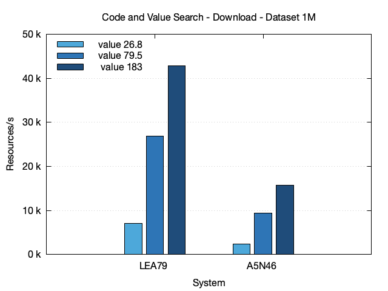

| System | Dataset | Code    | Value | # Hits | Time (s) | StdDev |  Res/s ¹ |
|--------|---------|---------|------:|-------:|---------:|-------:|---------:|
| LEA79  | 1M      | 29463-7 |  26.8 |  1.6 M |   219.15 |  0.124 |    7.1 k |
| LEA79  | 1M      | 29463-7 |  79.5 |  7.8 M |   292.11 |  0.204 |   26.9 k |
| LEA79  | 1M      | 29463-7 |   183 | 15.9 M |   370.41 |  0.563 |   42.9 k |
| A5N46  | 1M      | 29463-7 |  26.8 |  1.6 M |   641.96 |  1.024 |    2.4 k |
| A5N46  | 1M      | 29463-7 |  79.5 |  7.8 M |   831.55 |  4.721 |    9.4 k |
| A5N46  | 1M      | 29463-7 |   183 | 15.9 M |  1006.56 | 13.350 |   15.8 k |

¹ resources per second

### Downloading Resources with Subsetting

If only a subset of a resource's information is needed, the `_elements` search parameter can be used to retrieve only specific properties. In this case, `_elements=subject` was used.

| System | Dataset | Code    | Value | # Hits | Time (s) | StdDev |  Res/s ¹ |
|--------|---------|---------|------:|-------:|---------:|-------:|---------:|
| LEA79  | 1M      | 29463-7 |  26.8 |  1.6 M |   214.81 |  0.100 |    7.3 k |
| LEA79  | 1M      | 29463-7 |  79.5 |  7.8 M |   268.55 |  0.067 |   29.2 k |
| LEA79  | 1M      | 29463-7 |   183 | 15.9 M |   324.88 |  0.318 |   49.0 k |
| A5N46  | 1M      | 29463-7 |  26.8 |  1.6 M |   638.87 |  0.228 |    2.4 k |
| A5N46  | 1M      | 29463-7 |  79.5 |  7.8 M |   812.76 |  0.553 |    9.7 k |
| A5N46  | 1M      | 29463-7 |   183 | 15.9 M |   966.12 |  0.455 |   16.5 k |

¹ resources per second

## Code and Date Search

This section evaluates the performance of FHIR Search for selecting Observation resources with a specific code and date.

### Script

The script `code-date-search.sh` is used.

### Counting

| System | Dataset | Code    | Date | # Hits | Time (s) | StdDev | Res/s ¹ |
|--------|---------|---------|-----:|-------:|---------:|-------:|--------:|
| LEA47  | 1M      | 8310-5  | 2013 |   50 k |     0.42 |  0.006 | 119.1 k | 
| LEA47  | 1M      | 8310-5  | 2019 |   85 k |     0.42 |  0.008 | 200.9 k | 
| LEA47  | 1M      | 8310-5  | 2020 |  273 k |     0.45 |  0.001 | 601.3 k |
| LEA47  | 1M      | 55758-7 | 2013 |  549 k |    18.38 |  2.954 |  29.9 k | 
| LEA47  | 1M      | 55758-7 | 2019 |  1.0 M |    16.52 |  0.112 |  63.2 k | 
| LEA47  | 1M      | 55758-7 | 2020 |  1.1 M |    16.74 |  0.238 |  63.9 k |
| LEA47  | 1M      | 72514-3 | 2013 |  1.4 M |   220.21 | 38.049 |   6.6 k | 
| LEA47  | 1M      | 72514-3 | 2019 |  2.8 M |   278.23 | 10.056 |  10.2 k | 
| LEA47  | 1M      | 72514-3 | 2020 |  2.9 M |   274.85 | 20.144 |  10.7 k |
| LEA58  | 1M      | 8310-5  | 2013 |   50 k |     0.41 |  0.009 | 121.7 k | 
| LEA58  | 1M      | 8310-5  | 2019 |   85 k |     0.41 |  0.008 | 208.2 k | 
| LEA58  | 1M      | 8310-5  | 2020 |  273 k |     0.41 |  0.003 | 662.0 k |
| LEA58  | 1M      | 55758-7 | 2013 |  549 k |     9.45 |  0.038 |  58.0 k | 
| LEA58  | 1M      | 55758-7 | 2019 |  1.0 M |     9.68 |  0.025 | 107.8 k | 
| LEA58  | 1M      | 55758-7 | 2020 |  1.1 M |     9.57 |  0.020 | 111.8 k |
| LEA58  | 1M      | 72514-3 | 2013 |  1.4 M |    16.96 |  0.180 |  85.1 k | 
| LEA58  | 1M      | 72514-3 | 2019 |  2.8 M |    17.01 |  0.076 | 167.1 k | 
| LEA58  | 1M      | 72514-3 | 2020 |  2.9 M |    17.29 |  0.085 | 170.2 k |
| LEA79  | 1M      | 8310-5  | 2013 |   50 k |     0.22 |  0.009 | 233.6 k | 
| LEA79  | 1M      | 8310-5  | 2019 |   85 k |     0.23 |  0.014 | 378.1 k | 
| LEA79  | 1M      | 8310-5  | 2020 |  273 k |     0.23 |  0.018 |   1.2 M |
| LEA79  | 1M      | 55758-7 | 2013 |  549 k |     2.76 |  0.080 | 198.6 k | 
| LEA79  | 1M      | 55758-7 | 2019 |  1.0 M |     2.93 |  0.128 | 356.7 k | 
| LEA79  | 1M      | 55758-7 | 2020 |  1.1 M |     2.84 |  0.062 | 376.7 k |
| LEA79  | 1M      | 72514-3 | 2013 |  1.4 M |     5.02 |  0.330 | 287.3 k | 
| LEA79  | 1M      | 72514-3 | 2019 |  2.8 M |     4.89 |  0.065 | 581.9 k | 
| LEA79  | 1M      | 72514-3 | 2020 |  2.9 M |     5.08 |  0.086 | 579.7 k |
| A5N46  | 1M      | 8310-5  | 2013 |   50 k |     0.25 |  0.003 | 204.3 k | 
| A5N46  | 1M      | 8310-5  | 2019 |   85 k |     0.27 |  0.007 | 320.0 k | 
| A5N46  | 1M      | 8310-5  | 2020 |  273 k |     0.28 |  0.003 | 968.8 k |
| A5N46  | 1M      | 55758-7 | 2013 |  549 k |    42.44 |  0.081 |  12.9 k | 
| A5N46  | 1M      | 55758-7 | 2019 |  1.0 M |    43.57 |  0.056 |  23.9 k | 
| A5N46  | 1M      | 55758-7 | 2020 |  1.1 M |    43.57 |  0.044 |  24.5 k |
| A5N46  | 1M      | 72514-3 | 2013 |  1.4 M |    56.67 |  0.803 |  25.5 k | 
| A5N46  | 1M      | 72514-3 | 2019 |  2.8 M |    54.80 |  0.314 |  51.9 k | 
| A5N46  | 1M      | 72514-3 | 2020 |  2.9 M |    53.58 |  0.051 |  54.9 k |

¹ resources per second

### Downloading Resources

| System | Dataset | Code    | Date | # Hits | Time (s) |  StdDev | Res/s ¹ |
|--------|---------|---------|-----:|-------:|---------:|--------:|--------:|
| LEA47  | 1M      | 8310-5  | 2013 |   50 k |     5.93 |   0.016 |   8.5 k |
| LEA47  | 1M      | 8310-5  | 2019 |   85 k |     6.60 |   0.025 |  12.9 k |
| LEA47  | 1M      | 8310-5  | 2020 |  273 k |     9.89 |   0.062 |  27.6 k |
| LEA47  | 1M      | 55758-7 | 2013 |  549 k |   253.20 |   1.566 |   2.2 k |
| LEA47  | 1M      | 55758-7 | 2019 |  1.0 M |   470.48 | 266.452 |   2.2 k |
| LEA47  | 1M      | 55758-7 | 2020 |  1.1 M |   274.58 |  10.132 |   3.9 k |
| LEA47  | 1M      | 72514-3 | 2013 |  1.4 M |  3107.67 | 498.287 |     464 |
| LEA47  | 1M      | 72514-3 | 2019 |  2.8 M |  4180.95 | 150.134 |     680 |
| LEA47  | 1M      | 72514-3 | 2020 |  2.9 M |  4316.09 |   9.551 |     682 |
| LEA58  | 1M      | 8310-5  | 2013 |   50 k |     6.06 |   0.025 |   8.3 k |
| LEA58  | 1M      | 8310-5  | 2019 |   85 k |     6.75 |   0.057 |  12.6 k |
| LEA58  | 1M      | 8310-5  | 2020 |  273 k |    10.03 |   0.065 |  27.2 k |
| LEA58  | 1M      | 55758-7 | 2013 |  549 k |   251.57 |   0.633 |   2.2 k |
| LEA58  | 1M      | 55758-7 | 2019 |  1.0 M |   264.94 |   1.160 |   3.9 k |
| LEA58  | 1M      | 55758-7 | 2020 |  1.1 M |   265.40 |   2.129 |   4.0 k |
| LEA58  | 1M      | 72514-3 | 2013 |  1.4 M |   468.79 |   3.568 |   3.1 k |
| LEA58  | 1M      | 72514-3 | 2019 |  2.8 M |   505.10 |   8.743 |   5.6 k |
| LEA58  | 1M      | 72514-3 | 2020 |  2.9 M |   504.28 |   4.828 |   5.8 k |
| LEA79  | 1M      | 8310-5  | 2013 |   50 k |     4.13 |   0.008 |  12.2 k |
| LEA79  | 1M      | 8310-5  | 2019 |   85 k |     4.54 |   0.016 |  18.8 k |
| LEA79  | 1M      | 8310-5  | 2020 |  273 k |    10.06 |   1.220 |  27.2 k |
| LEA79  | 1M      | 55758-7 | 2013 |  549 k |   144.11 |   0.295 |   3.8 k |
| LEA79  | 1M      | 55758-7 | 2019 |  1.0 M |   151.25 |   0.151 |   6.9 k |
| LEA79  | 1M      | 55758-7 | 2020 |  1.1 M |   151.23 |   0.050 |   7.1 k |
| LEA79  | 1M      | 72514-3 | 2013 |  1.4 M |   270.97 |   0.148 |   5.3 k |
| LEA79  | 1M      | 72514-3 | 2019 |  2.8 M |   288.59 |   0.176 |   9.9 k |
| LEA79  | 1M      | 72514-3 | 2020 |  2.9 M |   290.46 |   0.207 |  10.1 k |
| A5N46  | 1M      | 8310-5  | 2013 |   50 k |     3.17 |   0.016 |  15.9 k |
| A5N46  | 1M      | 8310-5  | 2019 |   85 k |     3.46 |   0.009 |  24.6 k |
| A5N46  | 1M      | 8310-5  | 2020 |  273 k |     4.98 |   0.000 |  54.9 k |
| A5N46  | 1M      | 55758-7 | 2013 |  549 k |   378.26 |   0.223 |   1.5 k |
| A5N46  | 1M      | 55758-7 | 2019 |  1.0 M |   414.69 |   0.324 |   2.5 k |
| A5N46  | 1M      | 55758-7 | 2020 |  1.1 M |   416.27 |   0.071 |   2.6 k |
| A5N46  | 1M      | 72514-3 | 2013 |  1.4 M |   705.09 |   0.856 |   2.0 k |
| A5N46  | 1M      | 72514-3 | 2019 |  2.8 M |   798.45 |   1.141 |   3.6 k |
| A5N46  | 1M      | 72514-3 | 2020 |  2.9 M |   803.98 |   0.665 |   3.7 k |

¹ resources per second

## Category and Date Search

This section evaluates the performance of FHIR Search for selecting Observation resources with a specific category and date.

### Script

The script `category-date-search.sh` is used.

### Counting

| System | Dataset | Code        | Date | # Hits | Time (s) | StdDev | Res/s ¹ |
|--------|---------|-------------|-----:|-------:|---------:|-------:|--------:|
| LEA47  | 1M      | laboratory  | 2013 | 19.6 M |   194.72 |  1.585 | 100.8 k | 
| LEA47  | 1M      | laboratory  | 2019 | 38.4 M |   204.33 |  0.532 | 187.9 k | 
| LEA47  | 1M      | laboratory  | 2020 | 44.9 M |   205.06 |  0.565 | 219.0 k |
| LEA47  | 1M      | vital-signs | 2013 |  7.6 M |   326.83 |  6.978 |  23.2 k | 
| LEA47  | 1M      | vital-signs | 2019 | 14.3 M |   338.42 |  0.157 |  42.3 k | 
| LEA47  | 1M      | vital-signs | 2020 | 15.8 M |   334.29 |  4.415 |  47.2 k |
| LEA58  | 1M      | laboratory  | 2013 | 19.6 M |   118.38 |  0.677 | 165.8 k | 
| LEA58  | 1M      | laboratory  | 2019 | 38.4 M |   117.87 |  0.465 | 325.8 k | 
| LEA58  | 1M      | laboratory  | 2020 | 44.9 M |   140.11 | 19.633 | 320.5 k |
| LEA58  | 1M      | vital-signs | 2013 |  7.6 M |    43.99 |  0.135 | 172.8 k | 
| LEA58  | 1M      | vital-signs | 2019 | 14.3 M |    45.09 |  0.629 | 317.8 k | 
| LEA58  | 1M      | vital-signs | 2020 | 15.8 M |    44.77 |  0.547 | 352.8 k |
| LEA79  | 1M      | laboratory  | 2013 | 19.6 M |    81.19 |  0.646 | 241.8 k | 
| LEA79  | 1M      | laboratory  | 2019 | 38.4 M |    80.68 |  0.342 | 475.9 k | 
| LEA79  | 1M      | laboratory  | 2020 | 44.9 M |    85.68 |  5.139 | 524.0 k |
| LEA79  | 1M      | vital-signs | 2013 |  7.6 M |    28.12 |  6.310 | 270.3 k | 
| LEA79  | 1M      | vital-signs | 2019 | 14.3 M |    23.31 |  0.019 | 614.7 k | 
| LEA79  | 1M      | vital-signs | 2020 | 15.8 M |    23.34 |  0.087 | 676.8 k |
| A5N46  | 1M      | laboratory  | 2013 | 19.6 M |    94.21 |  0.532 | 208.4 k | 
| A5N46  | 1M      | laboratory  | 2019 | 38.4 M |    94.81 |  0.118 | 405.0 k | 
| A5N46  | 1M      | laboratory  | 2020 | 44.9 M |    95.60 |  0.522 | 469.7 k |
| A5N46  | 1M      | vital-signs | 2013 |  7.6 M |    64.72 |  1.318 | 117.4 k | 
| A5N46  | 1M      | vital-signs | 2019 | 14.3 M |    66.35 |  1.094 | 215.9 k | 
| A5N46  | 1M      | vital-signs | 2020 | 15.8 M |    66.90 |  0.475 | 236.1 k |

## Code and Patient Search

This section evaluates the performance of FHIR Search for selecting Observation resources with a specific code for 1000 patients.

### Script

The script `code-patient-search.sh` is used.

### Counting

| System | Dataset | Code    | # Hits | Time (s) | StdDev | Res/s ¹ |
|--------|---------|---------|-------:|---------:|-------:|--------:|
| LEA47  | 1M      | 8310-5  |    943 |     0.03 |  0.002 |  35.7 k |
| LEA47  | 1M      | 55758-7 |   28 k |     0.10 |  0.003 | 288.1 k |
| LEA47  | 1M      | 72514-3 |  113 k |     0.24 |  0.002 | 478.7 k |
| LEA58  | 1M      | 8310-5  |    943 |     0.03 |  0.002 |  34.4 k |
| LEA58  | 1M      | 55758-7 |   28 k |     0.10 |  0.001 | 275.4 k |
| LEA58  | 1M      | 72514-3 |  113 k |     0.29 |  0.010 | 392.0 k |
| LEA79  | 1M      | 8310-5  |    944 |     0.02 |  0.007 |  38.3 k |
| LEA79  | 1M      | 55758-7 |   28 k |     0.08 |  0.010 | 347.1 k |
| LEA79  | 1M      | 72514-3 |  113 k |     0.17 |  0.016 | 662.2 k |
| A5N46  | 1M      | 8310-5  |    944 |     0.01 |  0.001 |  80.9 k |
| A5N46  | 1M      | 55758-7 |   28 k |     0.05 |  0.001 | 568.6 k |
| A5N46  | 1M      | 72514-3 |  113 k |     0.12 |  0.001 | 907.9 k |

¹ resources per second

### Downloading Resources

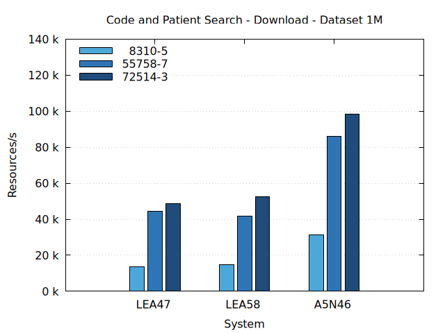

| System | Dataset | Code    | # Hits | Time (s) | StdDev | Res/s ¹ |
|--------|---------|---------|-------:|---------:|-------:|--------:|
| LEA47  | 1M      | 8310-5  |    943 |     0.07 |  0.000 |  13.5 k |
| LEA47  | 1M      | 55758-7 |   28 k |     0.63 |  0.014 |  44.6 k |
| LEA47  | 1M      | 72514-3 |  113 k |     2.33 |  0.024 |  48.5 k |
| LEA58  | 1M      | 8310-5  |    943 |     0.06 |  0.005 |  14.9 k |
| LEA58  | 1M      | 55758-7 |   28 k |     0.68 |  0.005 |  41.6 k |
| LEA58  | 1M      | 72514-3 |  113 k |     2.16 |  0.065 |  52.4 k |
| LEA79  | 1M      | 8310-5  |    944 |     0.04 |  0.009 |  25.7 k |
| LEA79  | 1M      | 55758-7 |   28 k |     0.66 |  0.029 |  42.5 k |
| LEA79  | 1M      | 72514-3 |  113 k |     2.30 |  0.047 |  49.1 k |
| A5N46  | 1M      | 8310-5  |    944 |     0.02 |  0.005 |  40.5 k |
| A5N46  | 1M      | 55758-7 |   28 k |     0.29 |  0.014 |  97.1 k |
| A5N46  | 1M      | 72514-3 |  113 k |     0.89 |  0.012 | 126.7 k |

¹ resources per second

### Downloading Resources with Subsetting

If only a subset of a resource's information is needed, the `_elements` search parameter can be used to retrieve only specific properties. In this case, `_elements=subject` was used.

| System | Dataset | Code    | # Hits | Time (s) | StdDev | Res/s ¹ |
|--------|---------|---------|-------:|---------:|-------:|--------:|
| LEA47  | 1M      | 8310-5  |    943 |     0.04 |  0.000 |  23.6 k |
| LEA47  | 1M      | 55758-7 |   28 k |     0.48 |  0.012 |  59.0 k |
| LEA47  | 1M      | 72514-3 |  113 k |     1.63 |  0.000 |  69.4 k |
| LEA58  | 1M      | 8310-5  |    943 |     0.04 |  0.000 |  23.6 k |
| LEA58  | 1M      | 55758-7 |   28 k |     0.48 |  0.016 |  58.6 k |
| LEA58  | 1M      | 72514-3 |  113 k |     1.53 |  0.043 |  73.9 k |
| LEA79  | 1M      | 8310-5  |    944 |     0.03 |  0.005 |  35.4 k |
| LEA79  | 1M      | 55758-7 |   28 k |     0.49 |  0.037 |  57.5 k |
| LEA79  | 1M      | 72514-3 |  113 k |     1.66 |  0.017 |  68.3 k |
| A5N46  | 1M      | 8310-5  |    944 |     0.02 |  0.005 |  56.6 k |
| A5N46  | 1M      | 55758-7 |   28 k |     0.22 |  0.005 | 130.0 k |
| A5N46  | 1M      | 72514-3 |  113 k |     0.65 |  0.005 | 175.0 k |

¹ resources per second

## Multiple Codes and Patient Search

This section evaluates the performance of FHIR Search for selecting Observation and Condition resources with multiple codes for 1000 patients.

The following codes were used:

* 10 LOINC codes from `observation-codes-10.txt`
* 100 LOINC codes from `observation-codes-100.txt`
* 1k SNOMED CT codes from `condition-codes-disease-1k.txt`
* 10k SNOMED CT codes from `condition-codes-disease-10k.txt`

### Script

The script `multiple-codes-patient-search.sh` is used.

### Counting

| System | Dataset | Codes | # Hits | Time (s) | StdDev | Res/s ¹ |
|--------|---------|------:|-------:|---------:|-------:|--------:|
| LEA47  | 1M      |    10 |  121 k |     0.30 |  0.004 | 408.8 k |
| LEA47  | 1M      |   100 |  1.1 M |     2.33 |  0.005 | 470.1 k |
| LEA47  | 1M      |    1k |    247 |     2.80 |  0.006 |      88 |
| LEA47  | 1M      |   10k |    1 k |    39.80 |  0.146 |      32 |
| LEA58  | 1M      |    10 |  121 k |     0.31 |  0.011 | 396.5 k |
| LEA58  | 1M      |   100 |  1.1 M |     2.47 |  0.022 | 443.8 k |
| LEA58  | 1M      |    1k |    247 |     2.89 |  0.011 |      85 |
| LEA58  | 1M      |   10k |    1 k |    41.13 |  0.439 |      31 |
| LEA79  | 1M      |    10 |  121 k |     0.23 |  0.015 | 524.8 k |
| LEA79  | 1M      |   100 |  109 k |     0.39 |  0.018 | 279.4 k |
| LEA79  | 1M      |    1k |    247 |     1.76 |  0.006 |     141 |
| LEA79  | 1M      |   10k |    1 k |    28.15 |  0.110 |      45 |
| A5N46  | 1M      |    10 |  121 k |     0.16 |  0.001 | 741.0 k |
| A5N46  | 1M      |   100 |  109 k |     0.29 |  0.002 | 372.3 k |
| A5N46  | 1M      |    1k |    247 |     1.35 |  0.006 |     183 |
| A5N46  | 1M      |   10k |    1 k |    21.58 |  0.022 |      59 |

¹ resources per second

### Downloading Resources

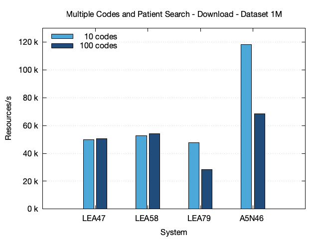

| System | Dataset | Codes | # Hits | Time (s) | StdDev | Res/s ¹ |
|--------|---------|------:|-------:|---------:|-------:|--------:|
| LEA47  | 1M      |    10 |  121 k |     2.44 |  0.054 |  49.7 k |
| LEA47  | 1M      |   100 |  1.1 M |    21.70 |  0.310 |  50.5 k |
| LEA47  | 1M      |    1k |    247 |     2.81 |  0.016 |      88 |
| LEA47  | 1M      |   10k |    1 k |    40.48 |  0.237 |      31 |
| LEA58  | 1M      |    10 |  121 k |     2.30 |  0.106 |  52.7 k |
| LEA58  | 1M      |   100 |  1.1 M |    20.19 |  0.281 |  54.3 k |
| LEA58  | 1M      |    1k |    247 |     2.88 |  0.042 |      86 |
| LEA58  | 1M      |   10k |    1 k |    40.97 |  0.233 |      31 |
| LEA79  | 1M      |    10 |  121 k |     2.54 |  0.168 |  47.8 k |
| LEA79  | 1M      |   100 |  109 k |     3.84 |  0.034 |  28.3 k |
| LEA79  | 1M      |    1k |    247 |     1.72 |  0.009 |     144 |
| LEA79  | 1M      |   10k |    1 k |    28.07 |  0.022 |      45 |
| A5N46  | 1M      |    10 |  121 k |     1.03 |  0.017 | 118.1 k |
| A5N46  | 1M      |   100 |  109 k |     1.59 |  0.012 |  68.6 k |
| A5N46  | 1M      |    1k |    247 |     1.35 |  0.005 |     183 |
| A5N46  | 1M      |   10k |    1 k |    21.62 |  0.033 |      59 |

¹ resources per second

## Code, Date, and Patient Search

This section evaluates the performance of FHIR Search for selecting Observation resources with a specific code, a specific date, and for 1000 patients.

### Script

The script `code-date-patient-search.sh` is used.

### Counting

| System | Dataset | Code    | # Hits | Time (s) | StdDev | Res/s ¹ |
|--------|---------|---------|-------:|---------:|-------:|--------:|
| LEA47  | 1M      | 8310-5  |    246 |     0.04 |  0.006 |   6.9 k |
| LEA47  | 1M      | 55758-7 |    3 k |     0.15 |  0.001 |  18.2 k |
| LEA47  | 1M      | 72514-3 |   12 k |     0.43 |  0.009 |  27.9 k |
| LEA79  | 1M      | 8310-5  |    246 |     0.03 |  0.007 |   8.2 k |
| LEA79  | 1M      | 55758-7 |    3 k |     0.12 |  0.017 |  22.8 k |
| LEA79  | 1M      | 72514-3 |   12 k |     0.31 |  0.013 |  39.2 k |
| A5N46  | 1M      | 8310-5  |    246 |     0.01 |  0.001 |  17.3 k |
| A5N46  | 1M      | 55758-7 |    3 k |     0.08 |  0.002 |  36.2 k |
| A5N46  | 1M      | 72514-3 |   12 k |     0.22 |  0.002 |  53.6 k |

¹ resources per second

### Downloading Resources

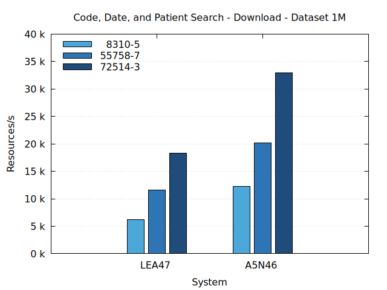

| System | Dataset | Code    | # Hits | Time (s) | StdDev | Res/s ¹ |
|--------|---------|---------|-------:|---------:|-------:|--------:|
| LEA47  | 1M      | 8310-5  |    246 |     0.04 |  0.000 |   6.2 k |
| LEA47  | 1M      | 55758-7 |    3 k |     0.24 |  0.005 |  11.6 k |
| LEA47  | 1M      | 72514-3 |   12 k |     0.65 |  0.017 |  18.3 k |
| LEA79  | 1M      | 8310-5  |    246 |     0.03 |  0.014 |   8.2 k |
| LEA79  | 1M      | 55758-7 |    3 k |     0.15 |  0.005 |  18.4 k |
| LEA79  | 1M      | 72514-3 |   12 k |     0.50 |  0.079 |  23.8 k |
| A5N46  | 1M      | 8310-5  |    246 |     0.02 |  0.005 |  14.8 k |
| A5N46  | 1M      | 55758-7 |    3 k |     0.13 |  0.005 |  21.2 k |
| A5N46  | 1M      | 72514-3 |   12 k |     0.35 |  0.009 |  34.5 k |

¹ resources per second

### Downloading Resources with Subsetting

If only a subset of a resource's information is needed, the `_elements` search parameter can be used to retrieve only specific properties. In this case, `_elements=subject` was used.

| System | Dataset | Code    | # Hits | Time (s) | StdDev | Res/s ¹ |
|--------|---------|---------|-------:|---------:|-------:|--------:|
| LEA47  | 1M      | 8310-5  |    246 |     0.03 |  0.000 |   8.2 k |
| LEA47  | 1M      | 55758-7 |    3 k |     0.19 |  0.005 |  14.6 k |
| LEA47  | 1M      | 72514-3 |   12 k |     0.61 |  0.016 |  19.6 k |
| LEA79  | 1M      | 8310-5  |    246 |     0.03 |  0.005 |   9.2 k |
| LEA79  | 1M      | 55758-7 |    3 k |     0.15 |  0.014 |  18.8 k |
| LEA79  | 1M      | 72514-3 |   12 k |     0.46 |  0.077 |  25.8 k |
| A5N46  | 1M      | 8310-5  |    246 |     0.01 |  0.000 |  24.6 k |
| A5N46  | 1M      | 55758-7 |    3 k |     0.11 |  0.000 |  25.7 k |
| A5N46  | 1M      | 72514-3 |   12 k |     0.31 |  0.000 |  38.6 k |

¹ resources per second

## Simple Date Search

This section evaluates the performance of FHIR Search for selecting Observation resources with a specific effective year.

### Script

The script `simple-date-search.sh` is used.

### Counting

| System | Dataset | Year | # Hits | Time (s) | StdDev | Res/s ¹ |
|--------|---------|------|-------:|---------:|-------:|--------:|
| LEA36  | 100k    | 2013 |  3.1 M |     2.12 |  0.023 |    0.67 |
| LEA36  | 100k    | 2019 |  6.0 M |     3.81 |  0.062 |    0.63 |
| LEA47  | 100k    | 2013 |  3.1 M |     2.13 |  0.068 |    0.68 |
| LEA47  | 100k    | 2019 |  6.0 M |     4.17 |  0.175 |    0.69 |
| LEA58  | 100k    | 2013 |  3.1 M |     2.22 |  0.071 |    0.71 |
| LEA58  | 100k    | 2019 |  6.0 M |     4.19 |  0.056 |    0.70 |
| LEA47  | 1M      | 2013 | 31.1 M |   108.65 |  0.558 | 286.0 k |
| LEA47  | 1M      | 2019 | 60.0 M |   209.27 |  1.670 | 287.0 k |
| LEA58  | 1M      | 2013 | 31.1 M |   107.81 |  1.260 | 288.2 k |
| LEA58  | 1M      | 2019 | 60.0 M |   210.81 |  0.364 | 284.9 k |
| LEA79  | 1M      | 2013 | 31.1 M |    74.54 |  0.704 | 416.8 k |
| LEA79  | 1M      | 2019 | 60.0 M |   144.01 |  0.865 | 417.0 k |
| A5N46  | 1M      | 2013 | 31.1 M |    57.22 |  0.302 | 543.0 k |
| A5N46  | 1M      | 2019 | 60.0 M |   113.00 |  0.053 | 531.5 k |

¹ resources per second

### Downloading Resources

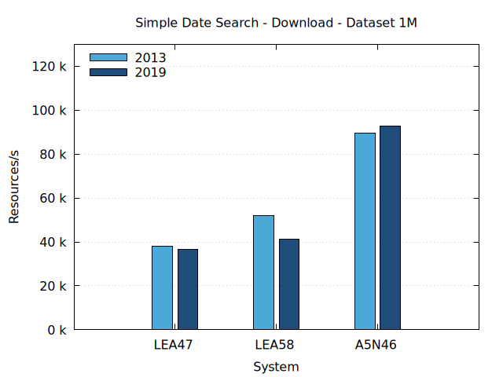

| System | Dataset | Year | # Hits | Time (s) | StdDev | Res/s ¹ |
|--------|---------|------|-------:|---------:|-------:|--------:|
| LEA36  | 100k    | 2013 |  3.1 M |    52.42 |  0.545 |   16.77 |
| LEA36  | 100k    | 2019 |  6.0 M |   129.84 |  5.393 |   21.71 |
| LEA47  | 100k    | 2013 |  3.1 M |    53.41 |  0.377 |   17.08 |
| LEA47  | 100k    | 2019 |  6.0 M |   107.15 |  0.116 |   17.92 |
| LEA58  | 100k    | 2013 |  3.1 M |    53.07 |  0.090 |   16.98 |
| LEA58  | 100k    | 2019 |  6.0 M |   100.73 |  0.473 |   16.84 |
| LEA47  | 1M      | 2013 | 31.1 M |   819.06 |  1.965 |  37.9 k |
| LEA47  | 1M      | 2019 | 60.0 M |  1634.48 | 16.647 |  36.7 k |
| LEA58  | 1M      | 2013 | 31.1 M |   596.05 | 18.812 |  52.1 k |
| LEA58  | 1M      | 2019 | 60.0 M |  1451.13 | 77.328 |  41.4 k |
| LEA79  | 1M      | 2013 | 31.1 M |   617.44 | 32.478 |  50.3 k |
| LEA79  | 1M      | 2019 | 60.0 M |  1231.04 |  1.890 |  48.8 k |
| A5N46  | 1M      | 2013 | 31.1 M |   256.12 |  1.458 | 121.3 k |
| A5N46  | 1M      | 2019 | 60.0 M |   502.11 |  0.465 | 119.6 k |

¹ resources per second

### Downloading Resources with Subsetting

If only a subset of a resource's information is needed, the `_elements` search parameter can be used to retrieve only specific properties. In this case, `_elements=subject` was used.

| System | Dataset | Year | # Hits | Time (s) | StdDev | Res/s ¹ |
|--------|---------|------|-------:|---------:|-------:|--------:|
| LEA36  | 100k    | 2013 |  3.1 M |    32.07 |  0.278 |   10.26 |
| LEA36  | 100k    | 2019 |  6.0 M |    79.92 |  4.179 |   13.36 |
| LEA47  | 100k    | 2013 |  3.1 M |    31.99 |  0.061 |   10.23 |
| LEA47  | 100k    | 2019 |  6.0 M |    66.33 |  0.045 |   11.09 |
| LEA58  | 100k    | 2013 |  3.1 M |    32.43 |  0.340 |   10.37 |
| LEA58  | 100k    | 2019 |  6.0 M |    62.14 |  0.488 |   10.39 |
| LEA47  | 1M      | 2013 | 31.1 M |   627.50 |  9.911 |  49.5 k |
| LEA47  | 1M      | 2019 | 60.0 M |  1282.05 |  4.997 |  46.8 k |
| LEA58  | 1M      | 2013 | 31.1 M |   439.48 |  1.237 |  70.7 k |
| LEA58  | 1M      | 2019 | 60.0 M |  1238.84 |  3.080 |  48.5 k |
| LEA79  | 1M      | 2013 | 31.1 M |   438.30 |  0.775 |  70.9 k |
| LEA79  | 1M      | 2019 | 60.0 M |   849.41 |  0.368 |  70.7 k |
| A5N46  | 1M      | 2013 | 31.1 M |   187.62 |  0.756 | 165.6 k |
| A5N46  | 1M      | 2019 | 60.0 M |   363.62 |  1.783 | 165.1 k |

¹ resources per second

## Patient Date Search

This section evaluates the performance of FHIR Search for selecting Patient resources with a specific birth date.

### Script

The script `patient-date-search.sh` is used.

### Counting

| System | Dataset | Date         | # Hits | Time (s) | StdDev | Res/s ¹ |
|--------|---------|--------------|-------:|---------:|-------:|--------:|
| LEA58  | 1M      | gt1998-04-10 |  227 k |     1.08 |  0.015 | 210.8 k |
| LEA58  | 1M      | ge1998-04-10 |  227 k |     1.16 |  0.023 | 196.1 k |
| LEA58  | 1M      | lt1998-04-10 |  773 k |     3.22 |  0.064 | 240.1 k |
| LEA58  | 1M      | le1998-04-10 |  773 k |     3.24 |  0.071 | 238.5 k |
| LEA79  | 1M      | gt1998-04-10 |  227 k |     0.69 |  0.014 | 327.6 k |
| LEA79  | 1M      | ge1998-04-10 |  227 k |     0.71 |  0.017 | 321.3 k |
| LEA79  | 1M      | lt1998-04-10 |  773 k |     2.20 |  0.024 | 351.1 k |
| LEA79  | 1M      | le1998-04-10 |  773 k |     2.12 |  0.006 | 364.2 k |
| A5N46  | 1M      | gt1998-04-10 |  227 k |     0.51 |  0.001 | 445.6 k |
| A5N46  | 1M      | ge1998-04-10 |  227 k |     0.53 |  0.005 | 426.4 k |
| A5N46  | 1M      | lt1998-04-10 |  773 k |     1.61 |  0.007 | 480.5 k |
| A5N46  | 1M      | le1998-04-10 |  773 k |     1.58 |  0.011 | 488.2 k |

¹ resources per second

### Downloading Resources

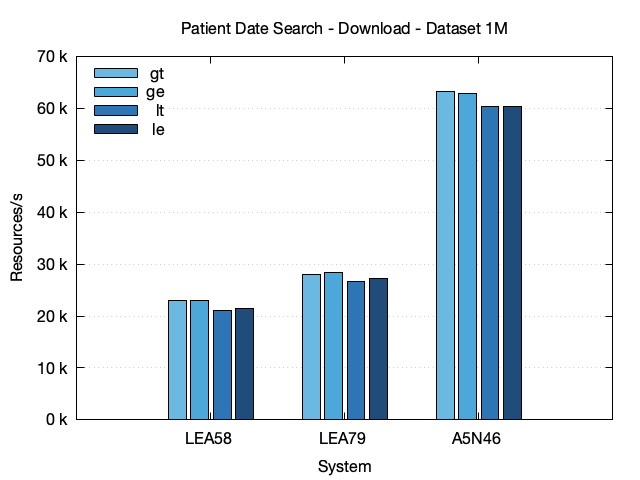

| System | Dataset | Date         | # Hits | Time (s) | StdDev | Res/s ¹ |
|--------|---------|--------------|-------:|---------:|-------:|--------:|
| LEA58  | 1M      | gt1998-04-10 |  227 k |     9.87 |  0.009 |  23.0 k |
| LEA58  | 1M      | ge1998-04-10 |  227 k |     9.86 |  0.052 |  23.0 k |
| LEA58  | 1M      | lt1998-04-10 |  773 k |    36.55 |  0.178 |  21.1 k |
| LEA58  | 1M      | le1998-04-10 |  773 k |    35.91 |  0.274 |  21.5 k |
| LEA79  | 1M      | gt1998-04-10 |  227 k |     8.14 |  0.183 |  27.9 k |
| LEA79  | 1M      | ge1998-04-10 |  227 k |     8.04 |  0.145 |  28.3 k |
| LEA79  | 1M      | lt1998-04-10 |  773 k |    28.96 |  0.045 |  26.7 k |
| LEA79  | 1M      | le1998-04-10 |  773 k |    28.35 |  0.242 |  27.2 k |
| A5N46  | 1M      | gt1998-04-10 |  227 k |     3.59 |  0.040 |  63.3 k |
| A5N46  | 1M      | ge1998-04-10 |  227 k |     3.61 |  0.071 |  62.9 k |
| A5N46  | 1M      | lt1998-04-10 |  773 k |    12.80 |  0.066 |  60.4 k |
| A5N46  | 1M      | le1998-04-10 |  773 k |    12.82 |  0.033 |  60.3 k |

¹ resources per second

### Downloading Resources with Subsetting

If only a subset of a resource's information is needed, the `_elements` search parameter can be used to retrieve only specific properties. In this case, `_elements=id` was used.

| System | Dataset | Date         | # Hits | Time (s) | StdDev | Res/s ¹ |
|--------|---------|--------------|-------:|---------:|-------:|--------:|
| LEA58  | 1M      | gt1998-04-10 |  227 k |     4.29 |  0.057 |  53.0 k |
| LEA58  | 1M      | ge1998-04-10 |  227 k |     4.18 |  0.082 |  54.4 k |
| LEA58  | 1M      | lt1998-04-10 |  773 k |    13.73 |  0.102 |  56.2 k |
| LEA58  | 1M      | le1998-04-10 |  773 k |    13.83 |  0.067 |  55.8 k |
| LEA79  | 1M      | gt1998-04-10 |  227 k |     3.90 |  0.060 |  58.2 k |
| LEA79  | 1M      | ge1998-04-10 |  227 k |     3.89 |  0.060 |  58.4 k |
| LEA79  | 1M      | lt1998-04-10 |  773 k |    12.80 |  0.127 |  60.3 k |
| LEA79  | 1M      | le1998-04-10 |  773 k |    13.12 |  0.117 |  58.9 k |
| A5N46  | 1M      | gt1998-04-10 |  227 k |     1.74 |  0.009 | 130.4 k |
| A5N46  | 1M      | ge1998-04-10 |  227 k |     1.74 |  0.014 | 130.7 k |
| A5N46  | 1M      | lt1998-04-10 |  773 k |     5.56 |  0.025 | 139.0 k |
| A5N46  | 1M      | le1998-04-10 |  773 k |     5.54 |  0.050 | 139.5 k |

¹ resources per second

## Used Dataset

The dataset was generated with Synthea v3.1.1. The resource generation process is described [here](synthea/README.md).

## Controlling and Monitoring the Caches

The size of the resource cache can be set with the `DB_RESOURCE_CACHE_SIZE_RATIO` environment variable, which specifies the ratio of JVM heap size that is allocated to the resource cache.

### Monitoring 

Blaze exposes a Prometheus monitoring endpoint on port 8081 by default. The ideal setup is to connect a Prometheus instance to it and use Grafana for visualization. However, for simple, ad-hoc queries about the current state of Blaze, `curl` and `grep` are sufficient.

#### Java Heap Size

The bytes currently used by the various generations of the Java heap are provided by the `jvm_memory_pool_bytes_used` metric. Of these, the `G1 Old Gen` is the most important, as cached resources are stored there. The following command fetches all metrics and filters for the relevant line:

```sh
curl -s http://localhost:8081/metrics | grep jvm_memory_pool_bytes_used | grep Old
jvm_memory_pool_bytes_used{pool="G1 Old Gen",} 8.325004288E9
```

Here, the value `8.325004288E9` is in bytes, and `E9` indicates gigabytes. This shows 8.3 GB of the old generation are in use, which constitutes most of the total heap size. If Blaze were configured with a maximum heap size of 10 GB, this usage would be within a healthy upper limit.

#### Resource Cache

Resource cache metrics are available under keys starting with `blaze_db_cache`. Among these is the `resource-cache`. These metrics can be difficult to interpret without a Prometheus/Grafana infrastructure because they are counters that accumulate since Blaze was started. Therefore, after a long runtime, it is necessary to calculate relative differences. However, shortly after Blaze starts, the absolute numbers are very useful on their own.

```sh
curl -s http://localhost:8081/metrics | grep blaze_db_cache | grep resource-cache
blaze_db_cache_hits_total{name="resource-cache",} 869000.0
blaze_db_cache_loads_total{name="resource-cache",} 13214.0
blaze_db_cache_load_failures_total{name="resource-cache",} 0.0
blaze_db_cache_load_seconds_total{name="resource-cache",} 234.418864426
blaze_db_cache_evictions_total{name="resource-cache",} 0.0
```

The number of evictions is a key metric here. As long as the number of evictions is zero, the resource cache has not overflowed. The goal should be for most CQL or FHIR Search queries with exports to fit within the resource cache. If the number of resources in a single query exceeds the cache size, the cache will be evicted and refilled during that query. This is especially problematic for repeated queries, as resources needed at the beginning of the query will no longer be in the cache after it is refilled. Therefore, a cache size smaller than what is required for a single query offers no performance benefit.

[1]: <https://www.hl7.org/fhir/search.html#elements>
