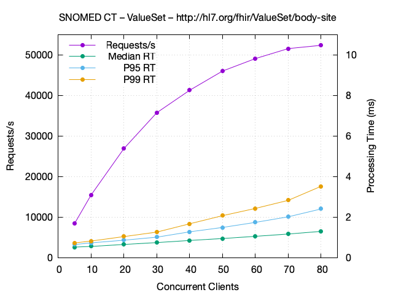
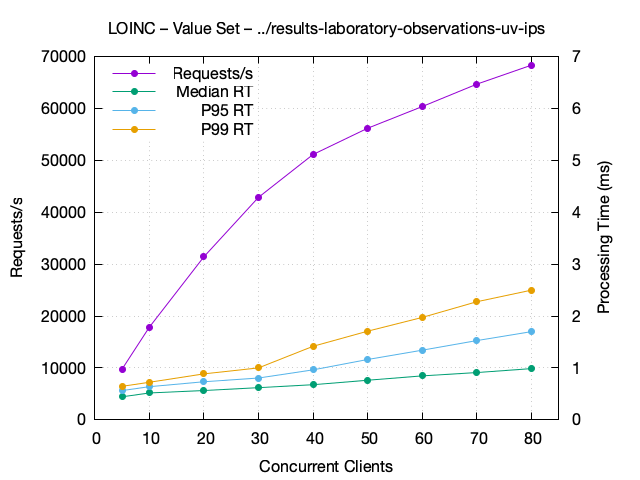
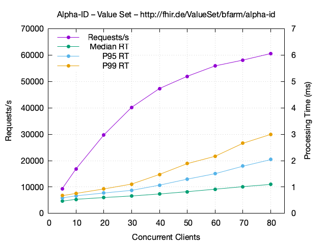

# Terminology Service

## System

The following system was used for performance evaluation:

| System | Provider | CPU         | Cores |     RAM |  SSD |
|--------|----------|-------------|------:|--------:|-----:|
| A5N46  | on-prem  | Ryzen 9900X |    24 |  96 GiB | 4 TB |

## Methods

The load testing tool [k6][1] is used to create load from another host as the test system.

## ValueSet \$validate-code

This section shows performance data of ValueSet $validate-code requests by a rising number of concurrent clients. The requests measured are:

```
GET [base]/ValueSet/$validate-code?url=[url]&system=[system]&code=[code]
```

The codes were taken from an expansion of the value set. In order to limit the amount of memory each client uses, the codes were further sampled down to about 1000 random codes. The result status of the response was checked to be true.

### SNOMED CT

The value set http://hl7.org/fhir/ValueSet/body-site contains one `is-a` filter with concept `442083009` (Anatomical or acquired body structure).



The purple curve shows the requests per second that were achieved by repeating $validate-code requests with a new random code for each request. There is no wait time between requests. The number of requests per second rise nearly linear with the number of concurrent clients up to about 30 clients were the growth declines. 

The green, blue and yellow curves show the processing time, without network effects, as median, 95% and 99% quantile. Especially the 99% quantile shows that the processing time behaves very good with only about 3.5 milli seconds at 80 concurrent clients.

### LOINC

The value set http://hl7.org/fhir/uv/ips/ValueSet/results-laboratory-observations-uv-ips contains two inclusion filter one with `STATUS = ACTIVE`, one with `CLASSTYPE = 1` and one exclusion filter with `CLASS =~ CYTO|HL7\.CYTOGEN|HL7\.GENETICS|^PATH(\..*)?|^MOLPATH(\..*)?|NR STATS|H&P\.HX\.LAB|CHALSKIN|LABORDERS`.



The performance is a better than with the SNOMED CT value set but overall comparable.

### Alpha-ID

The value set http://fhir.de/ValueSet/bfarm/alpha-id just includes all concepts from the code system http://fhir.de/CodeSystem/bfarm/alpha-id. The Alpha-ID code system, with its 90399 concepts, is chosen as a representative of a large non-built-in code system.



The performance is a slightly better than with the SNOMED CT value set but overall comparable.

[1]: <https://k6.io>
